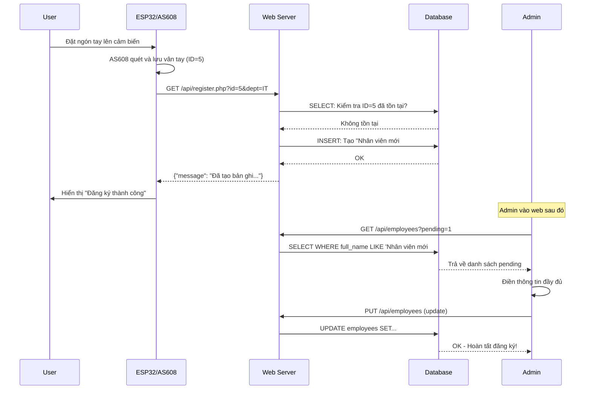
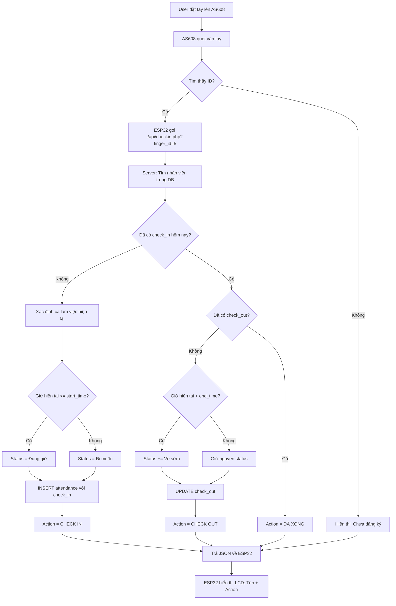
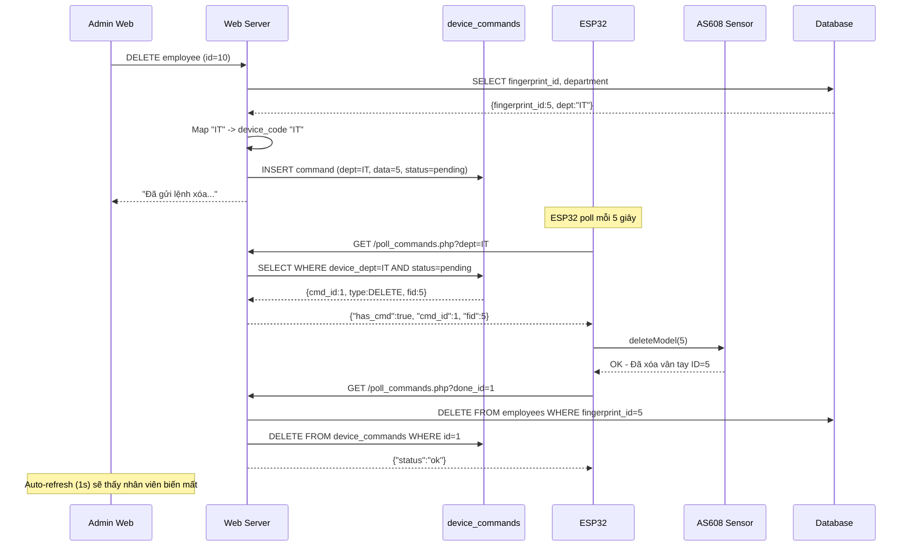
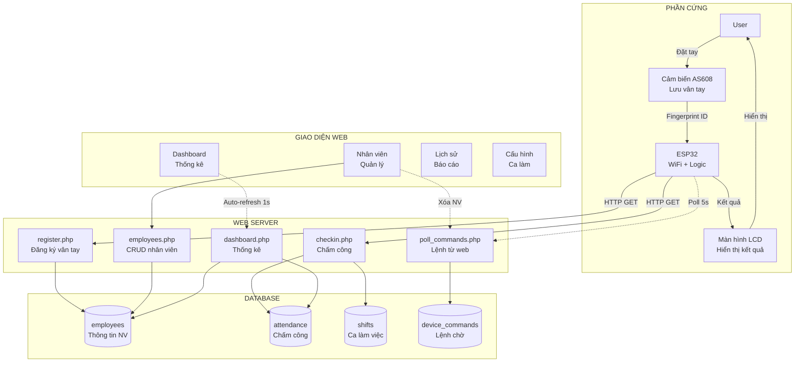

# ÔN TẬP - HỆ THỐNG CHẤM CÔNG VÂN TAY

## 📌 TỔNG QUAN HỆ THỐNG

Hệ thống bao gồm 2 phần:
1. **Phần cứng**: ESP32 + Cảm biến vân tay AS608
2. **Phần mềm**: Web Application (PHP + MySQL + JavaScript)

---

## 🔥 CHỨC NĂNG 1: ĐĂNG KÝ VÂN TAY MỚI

### A. Phần Cứng (Arduino/ESP32)
**Quy trình:**
1. User nhấn nút "Đăng ký vân tay" trên thiết bị
2. ESP32 yêu cầu user đặt ngón tay lên AS608
3. AS608 quét và lưu vân tay vào bộ nhớ với ID (ví dụ: ID = 5)
4. ESP32 gọi API đăng ký: `GET /api/register.php?id=5&dept=IT`

**Code Arduino (giả định):**
```cpp
// Hàm đăng ký vân tay
void registerFingerprint() {
  int id = finger.getNextFreeID(); // Tìm ID trống
  
  // Quét vân tay 2 lần để xác nhận
  if (finger.getImage() == FINGERPRINT_OK) {
    if (finger.image2Tz(1) == FINGERPRINT_OK) {
      // Quét lần 2
      if (finger.getImage() == FINGERPRINT_OK) {
        if (finger.image2Tz(2) == FINGERPRINT_OK) {
          // Tạo model và lưu
          if (finger.createModel() == FINGERPRINT_OK) {
            if (finger.storeModel(id) == FINGERPRINT_OK) {
              // Gửi lên server
              sendToServer(id);
            }
          }
        }
      }
    }
  }
}

void sendToServer(int fingerId) {
  String url = "http://server.com/api/register.php?id=" + String(fingerId) + "&dept=" + DEVICE_CODE;
  http.begin(url);
  int httpCode = http.GET();
  String response = http.getString();
  // Hiển thị kết quả trên LCD
}
```

### B. Phần Mềm (Web)

#### File: `api/register.php`
**Chức năng:** Nhận ID vân tay mới từ ESP32 và tạo bản ghi tạm thời

**Code xử lý:**
```php
// 1. Nhận ID từ ESP32
$fingerId = (int)$_GET['id'];
$deptCode = $_GET['dept'] ?? 'Chờ cập nhật';

// 2. Kiểm tra ID đã tồn tại chưa
$stmt = $pdo->prepare("SELECT id FROM employees WHERE fingerprint_id = ?");
$stmt->execute([$fingerId]);

if ($stmt->fetch()) {
    // ID đã tồn tại
    json_response(['message' => 'ID đã tồn tại']);
} else {
    // 3. Tạo nhân viên mới với thông tin tạm
    $tempName = "Nhân viên mới #" . $fingerId;
    
    // 4. Map device_code sang tên phòng ban
    $deptName = mapDeviceCodeToDeptName($deptCode);
    
    // 5. INSERT vào database
    $stmt = $pdo->prepare("INSERT INTO employees (fingerprint_id, full_name, department, position) VALUES (?, ?, ?, ?)");
    $stmt->execute([$fingerId, $tempName, $deptName, 'Nhân viên']);
}
```

**Bảng `employees` sau khi đăng ký:**
| id | fingerprint_id | full_name | department | position |
|----|---------------|-----------|------------|----------|
| 1  | 5             | Nhân viên mới #5 | IT | Nhân viên |

#### File: `public/assets/app.js` - Hoàn thiện thông tin
**Chức năng:** Admin vào web để cập nhật thông tin đầy đủ cho nhân viên mới

**Code xử lý:**
```javascript
// 1. Load danh sách nhân viên pending (chờ cập nhật)
async function openCompleteFingerprintEmployee() {
  // Gọi API lấy nhân viên có tên "Nhân viên mới #..."
  const res = await fetch(`${api.employees}?pending=1`);
  const pending = await res.json();
  
  // 2. Hiển thị modal với dropdown chọn nhân viên
  // 3. Admin chọn và điền thông tin: Họ tên, Phòng ban, Chức vụ, Ngày sinh
  // 4. Submit form
  
  const payload = {
    id: employeeId,
    full_name: "Nguyễn Văn A",
    department: "IT",
    position: "Developer",
    birth_year: "19900115"
  };
  
  // 5. Gọi API cập nhật
  await fetch(api.employees, {
    method: "PUT",
    body: JSON.stringify(payload)
  });
}
```

#### File: `api/employees.php` - Cập nhật thông tin
```php
case 'PUT':
    $payload = read_json_body();
    
    // Cập nhật thông tin nhân viên
    $stmt = $pdo->prepare("UPDATE employees SET full_name = ?, department = ?, position = ?, birth_year = ? WHERE id = ?");
    $stmt->execute([
        $payload['full_name'],
        $payload['department'], 
        $payload['position'],
        $payload['birth_year'],
        $payload['id']
    ]);
```

### C. Sơ Đồ Luồng Đăng Ký Vân Tay



---

## 🔥 CHỨC NĂNG 2: CHẤM CÔNG (CHECK IN/OUT)

### A. Phần Cứng (Arduino/ESP32)

**Code Arduino:**
```cpp
void checkAttendance() {
  // 1. Quét vân tay
  if (finger.getImage() == FINGERPRINT_OK) {
    if (finger.image2Tz() == FINGERPRINT_OK) {
      // 2. Tìm kiếm vân tay trong database AS608
      if (finger.fingerFastSearch() == FINGERPRINT_OK) {
        int foundID = finger.fingerID;
        
        // 3. Gọi API chấm công
        String url = "http://server.com/api/checkin.php?finger_id=" + String(foundID);
        http.begin(url);
        int httpCode = http.GET();
        
        // 4. Parse JSON response
        String response = http.getString();
        // {"status":"OK", "name":"Nguyễn Văn A", "action":"CHECK IN"}
        
        // 5. Hiển thị trên LCD
        lcd.print(response.name);
        lcd.print(" - " + response.action);
      }
    }
  }
}
```

### B. Phần Mềm (Web)

#### File: `api/checkin.php`
**Chức năng:** Xử lý chấm công tự động, xác định CHECK IN/OUT, tính trạng thái

**Code xử lý chi tiết:**

```php
// 1. Nhận finger_id từ ESP32
$fid = (int)$_GET['finger_id'];
$today = date('Y-m-d');
$now = date('H:i:s');

// 2. Tìm nhân viên
$stmt = $pdo->prepare("SELECT full_name FROM employees WHERE fingerprint_id = ?");
$stmt->execute([$fid]);
$user = $stmt->fetch();

if (!$user) {
    json_response(['status' => 'ERROR', 'message' => 'Chua dang ky']);
}

// 3. Lấy danh sách ca làm việc
$shifts = $pdo->query("SELECT id, shift_name, start_time, end_time FROM shifts ORDER BY start_time ASC")->fetchAll();

// 4. Hàm xác định ca hiện tại
function selectShiftForNow($shifts, $currentTime) {
    // Đang trong ca?
    foreach ($shifts as $shift) {
        if ($currentTime >= $shift['start_time'] && $currentTime <= $shift['end_time']) {
            return $shift;
        }
    }
    // Chưa tới giờ -> lấy ca sắp tới
    foreach ($shifts as $shift) {
        if ($currentTime < $shift['start_time']) {
            return $shift;
        }
    }
    // Sau ca cuối -> dùng ca cuối
    return end($shifts);
}

// 5. Kiểm tra đã có bản ghi chưa checkout
$stmt = $pdo->prepare("
    SELECT a.id, a.check_in, a.check_out, a.status, s.start_time, s.end_time
    FROM attendance a
    JOIN shifts s ON s.id = a.shift_id
    WHERE a.fingerprint_id = ? AND a.date = ? AND a.check_out IS NULL
    LIMIT 1
");
$stmt->execute([$fid, $today]);
$log = $stmt->fetch();

if ($log) {
    // ĐÃ CÓ CHECK IN -> Cập nhật CHECK OUT
    $isEarlyLeave = $now < $log['end_time'];
    $status = $log['status'];
    
    if ($isEarlyLeave && stripos($status, 'Về sớm') === false) {
        $status = $status . ' - Về sớm';
    }
    
    $pdo->prepare("UPDATE attendance SET check_out = ?, status = ? WHERE id = ?")->execute([$now, $status, $log['id']]);
    $action = "CHECK OUT";
    
} else {
    // CHƯA CÓ CHECK IN -> Tạo mới
    $shift = selectShiftForNow($shifts, $now);
    
    // Xác định trạng thái: Đúng giờ / Đi muộn
    $status = ($now <= $shift['start_time']) ? 'Đúng giờ' : 'Đi muộn';
    
    $pdo->prepare("INSERT INTO attendance (fingerprint_id, shift_id, date, check_in, status) VALUES (?, ?, ?, ?, ?)")->execute([$fid, $shift['id'], $today, $now, $status]);
    $action = "CHECK IN";
}

// 6. Trả về JSON
json_response([
    'status' => 'OK',
    'name' => $user['full_name'],
    'action' => $action
]);
```

### C. Sơ Đồ Luồng Chấm Công



### D. Ví Dụ Cụ Thể

**Scenario 1: Check In Đúng Giờ**
- Ca sáng: 08:00 - 17:00
- User chấm công lúc 7:55
- Kết quả: `status = "Đúng giờ"`, `check_in = 07:55:00`

**Scenario 2: Check In Đi Muộn**
- Ca sáng: 08:00 - 17:00
- User chấm công lúc 8:15
- Kết quả: `status = "Đi muộn"`, `check_in = 08:15:00`

**Scenario 3: Check Out Về Sớm**
- Ca sáng: 08:00 - 17:00
- Check in lúc 8:15 (Đi muộn)
- Check out lúc 16:30
- Kết quả: `status = "Đi muộn - Về sớm"`, `check_out = 16:30:00`

---

## 🔥 CHỨC NĂNG 3: XÓA VÂN TAY (ĐỒNG BỘ 2 CHIỀU)

### A. Quy Trình Đồng Bộ

**Đặc điểm:**
- Web KHÔNG xóa trực tiếp khỏi database
- Web tạo lệnh xóa trong `device_commands`
- ESP32 poll lệnh, xóa vân tay khỏi AS608
- ESP32 báo hoàn tất
- Web mới xóa khỏi database

### B. Phần Mềm (Web)

#### Bước 1: Admin xóa nhân viên trên web

**File: `public/assets/app.js`**
```javascript
async function deleteEmployee(id) {
  if (!confirm("Xóa nhân viên này?")) return;
  
  // Gọi API xóa (tạo lệnh chờ)
  const res = await fetch(`${apiBase}/delete.php`, {
    method: "POST",
    body: JSON.stringify({ id: id })
  });
  
  const result = await res.json();
  alert(result.message); // "Đã gửi lệnh xóa xuống thiết bị..."
}
```

**File: `api/delete.php`**
```php
// 1. Nhận employee ID từ web
$employeeId = $data['id'];

// 2. Lấy thông tin nhân viên
$stmt = $pdo->prepare("SELECT fingerprint_id, department FROM employees WHERE id = ?");
$stmt->execute([$employeeId]);
$employee = $stmt->fetch();

$fingerId = $employee['fingerprint_id'];
$deptName = $employee['department'];

// 3. Map department NAME sang device_code
$deviceCode = mapDeptNameToDeviceCode($deptName); // IT, KETOAN, ...

// 4. TẠO LỆNH XÓA trong queue (CHƯA xóa database)
$sql = "INSERT INTO device_commands (device_dept, command, data, status) VALUES (?, 'DELETE', ?, 'pending')";
$stmt = $pdo->prepare($sql);
$stmt->execute([$deviceCode, $fingerId]);

// 5. Trả về thông báo
echo json_encode(['status' => 'success', 'message' => 'Đã gửi lệnh xóa xuống thiết bị']);
```

**Bảng `device_commands` sau khi tạo lệnh:**
| id | device_dept | command | data | status |
|----|-------------|---------|------|--------|
| 1  | IT          | DELETE  | 5    | pending |

### C. Phần Cứng (Arduino/ESP32)

#### Bước 2: ESP32 poll lệnh từ server

**Code Arduino:**
```cpp
void pollCommands() {
  // 1. Gọi API để lấy lệnh pending
  String url = "http://server.com/api/poll_commands.php?dept=" + DEVICE_CODE; // dept=IT
  http.begin(url);
  int httpCode = http.GET();
  String response = http.getString();
  
  // Parse JSON
  // {"has_cmd":true, "cmd_id":1, "type":"DELETE", "fid":5}
  
  if (response.has_cmd) {
    int cmdId = response.cmd_id;
    int fingerIdToDelete = response.fid;
    
    // 2. Xóa vân tay khỏi AS608
    if (finger.deleteModel(fingerIdToDelete) == FINGERPRINT_OK) {
      // 3. Báo hoàn tất cho server
      confirmDelete(cmdId);
    }
  }
}

void confirmDelete(int cmdId) {
  String url = "http://server.com/api/poll_commands.php?done_id=" + String(cmdId);
  http.begin(url);
  http.GET();
  // Server sẽ XÓA khỏi database khi nhận được done_id
}
```

#### Bước 3: Server nhận xác nhận và xóa database

**File: `api/poll_commands.php`**
```php
// ESP32 REPORTS COMPLETION
if (isset($_GET['done_id'])) {
    $cmdId = (int)$_GET['done_id'];
    
    // 1. Lấy thông tin lệnh
    $stmt = $pdo->prepare("SELECT * FROM device_commands WHERE id = ?");
    $stmt->execute([$cmdId]);
    $cmd = $stmt->fetch();
    
    if ($cmd && $cmd['command'] === 'DELETE') {
        $fingerId = (int)$cmd['data'];
        
        // 2. BÂY GIỜ MỚI XÓA khỏi database
        $del = $pdo->prepare("DELETE FROM employees WHERE fingerprint_id = ?");
        $del->execute([$fingerId]);
        
        // 3. Xóa lệnh khỏi queue
        $pdo->prepare("DELETE FROM device_commands WHERE id = ?")->execute([$cmdId]);
        
        echo json_encode(['status' => 'ok', 'message' => 'Deleted']);
    }
}

// ESP32 POLLS FOR COMMANDS
$dept = $_GET['dept']; // IT

$stmt = $pdo->prepare("SELECT * FROM device_commands WHERE device_dept = ? AND status = 'pending' ORDER BY id ASC LIMIT 1");
$stmt->execute([$dept]);
$row = $stmt->fetch();

if ($row) {
    echo json_encode([
        'has_cmd' => true,
        'cmd_id'  => $row['id'],
        'type'    => 'DELETE',
        'fid'     => (int)$row['data']
    ]);
} else {
    echo json_encode(['has_cmd' => false]);
}
```

### D. Sơ Đồ Luồng Xóa Vân Tay



---

## 🔥 CHỨC NĂNG 4: HIỂN thị DASHBOARD

### A. Phần Mềm (Web)

#### File: `api/dashboard.php`
```php
// 1. Đếm tổng nhân viên
$totalEmployees = $pdo->query("SELECT COUNT(*) FROM employees")->fetchColumn();

// 2. Đếm người có mặt hôm nay
$today = date('Y-m-d');
$present = $pdo->prepare("SELECT COUNT(DISTINCT fingerprint_id) FROM attendance WHERE date = ?");
$present->execute([$today]);
$presentCount = $present->fetchColumn();

// 3. Đếm người đi muộn
$late = $pdo->prepare("SELECT COUNT(*) FROM attendance WHERE date = ? AND status LIKE '%muộn%'");
$late->execute([$today]);
$lateCount = $late->fetchColumn();

// 4. Tính người nghỉ
$absent = $totalEmployees - $presentCount;

// 5. Lấy danh sách chấm công hôm nay
$logs = $pdo->prepare("
    SELECT e.full_name, e.department, a.check_in, a.check_out, a.status, s.shift_name
    FROM attendance a
    JOIN employees e ON e.fingerprint_id = a.fingerprint_id
    JOIN shifts s ON s.id = a.shift_id
    WHERE a.date = ?
    ORDER BY a.check_in DESC
");
$logs->execute([$today]);

echo json_encode([
    'cards' => [
        'totalEmployees' => $totalEmployees,
        'present' => $presentCount,
        'late' => $lateCount,
        'absent' => $absent
    ],
    'todayLogs' => $logs->fetchAll()
]);
```

#### File: `public/assets/app.js`
```javascript
async function loadDashboard() {
  const res = await fetch(api.dashboard);
  const data = await res.json();
  
  // 1. Render cards thống kê
  document.getElementById("stats-cards").innerHTML = `
    <div class="card">Tổng nhân viên: ${data.cards.totalEmployees}</div>
    <div class="card">Đi làm: ${data.cards.present}</div>
    <div class="card">Đi muộn: ${data.cards.late}</div>
    <div class="card">Nghỉ: ${data.cards.absent}</div>
  `;
  
  // 2. Render bảng chấm công hôm nay
  document.getElementById("today-logs").innerHTML = data.todayLogs.map(row => `
    <tr>
      <td>${row.full_name}</td>
      <td>${row.department}</td>
      <td>${row.shift_name}</td>
      <td>${row.check_in}</td>
      <td>${row.check_out || '-'}</td>
      <td>${statusBadge(row.status)}</td>
    </tr>
  `).join('');
}

// Auto-refresh mỗi 1 giây
setInterval(loadDashboard, 1000);
```

---

## 🔥 CHỨC NĂNG 5: QUẢN LÝ PHÒNG BAN VÀ DEVICE_CODE

### A. Tại Sao Cần Device Code?

**Vấn đề:**
- Web lưu tên phòng ban tiếng Việt: "Kế Toán", "Nhân Sự"
- Arduino chỉ gửi mã ngắn: "IT", "KETOAN", "HR"

**Giải pháp:**
- Bảng mapping trong `api/departments.json`
- Mỗi phòng ban có: `name` (cho web) và `device_code` (cho hardware)

**File: `api/departments.json`**
```json
[
  {"id": 1, "name": "Kế Toán", "device_code": "KETOAN"},
  {"id": 2, "name": "Nhân Sự", "device_code": "HR"},
  {"id": 3, "name": "IT", "device_code": "IT"}
]
```

### B. Mapping Trong register.php

```php
// ESP32 gửi: dept=KETOAN
$deptCode = $_GET['dept']; // "KETOAN"

// Đọc file JSON
$depts = json_decode(file_get_contents(__DIR__ . '/departments.json'), true);

// Tìm department có device_code = "KETOAN"
foreach ($depts as $d) {
    if ($d['device_code'] === $deptCode) {
        $deptName = $d['name']; // "Kế Toán"
        break;
    }
}

// Lưu vào database với tên tiếng Việt
INSERT INTO employees (..., department) VALUES (..., 'Kế Toán');
```

### C. Mapping Trong delete.php

```php
// Lấy từ database: department = "Kế Toán"
$deptName = $employee['department'];

// Map ngược lại sang device_code
foreach ($depts as $d) {
    if ($d['name'] === $deptName) {
        $deviceCode = $d['device_code']; // "KETOAN"
        break;
    }
}

// Tạo lệnh với device_code
INSERT INTO device_commands (device_dept, ...) VALUES ('KETOAN', ...);
```

---

## 📊 SƠ ĐỒ TỔNG QUAN HỆ THỐNG



---

## 🎯 TÓM TẮT CÁC FILE QUAN TRỌNG

| File | Chức năng | Gọi từ | Thao tác DB |
|------|-----------|--------|-------------|
| `api/register.php` | Đăng ký vân tay mới | ESP32 | INSERT employees |
| `api/checkin.php` | Chấm công IN/OUT | ESP32 | INSERT/UPDATE attendance |
| `api/poll_commands.php` | Poll lệnh + Confirm | ESP32 | SELECT/DELETE device_commands, DELETE employees |
| `api/delete.php` | Tạo lệnh xóa | Web Admin | INSERT device_commands |
| `api/employees.php` | CRUD nhân viên | Web Admin | SELECT/INSERT/UPDATE employees |
| `api/dashboard.php` | Thống kê | Web Auto-refresh | SELECT từ tất cả bảng |
| `public/assets/app.js` | Logic frontend | Browser | Gọi tất cả APIs |

---

## ⚡ CÁC ĐIỂM ĐẶC BIỆT

### 1. Tại sao không xóa trực tiếp database?
- Vì vân tay còn lưu trong AS608
- Nếu xóa database trước, ESP32 không biết phải xóa ID nào
- Phải xóa AS608 trước, rồi mới xóa database

### 2. Auto-refresh hoạt động như thế nào?
```javascript
setInterval(() => {
  if (currentSection === 'dashboard') loadDashboard();
}, 1000); // Mỗi 1 giây
```

### 3. Làm sao biết Check IN hay Check OUT?
- Kiểm tra bản ghi ngày hôm nay:
  - `check_out IS NULL` → Cập nhật CHECK OUT
  - Không có bản ghi → Tạo mới CHECK IN

### 4. Badge màu status
```javascript
function statusBadge(status) {
  if (status.includes('về sớm')) return '<span class="badge danger">' + status + '</span>';
  if (status.includes('muộn')) return '<span class="badge warn">' + status + '</span>';
  if (status.includes('đúng giờ')) return '<span class="badge success">' + status + '</span>';
}
```

---

**Hết - Tài liệu ôn tập hệ thống chấm công vân tay**
