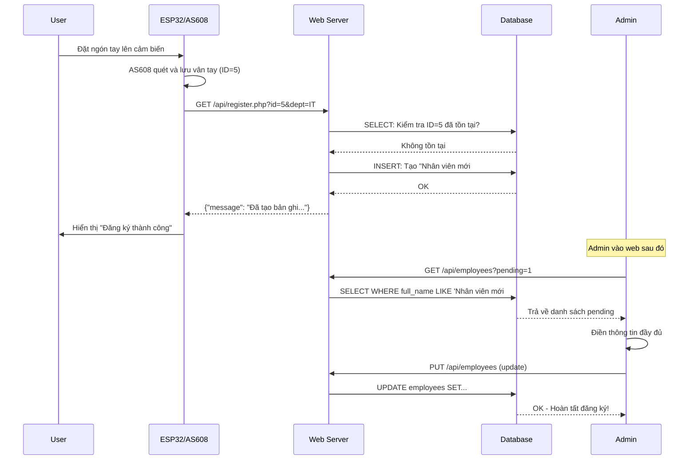
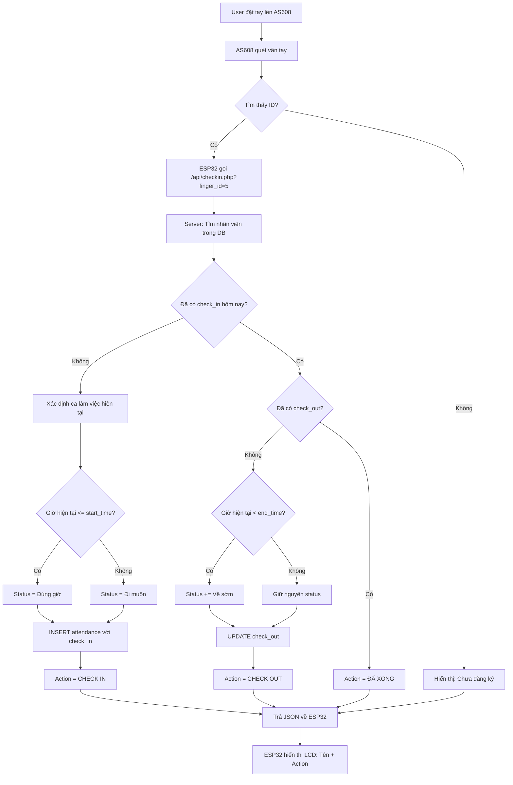
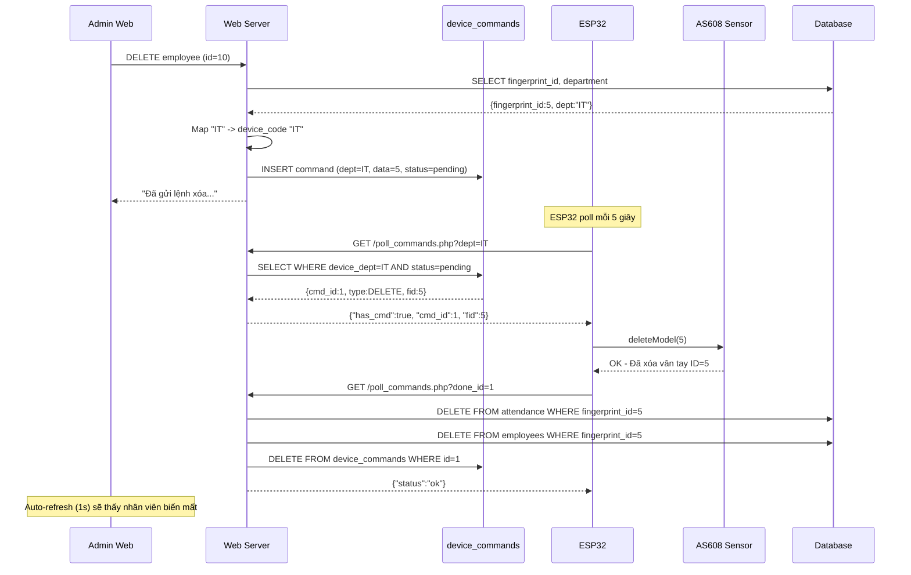
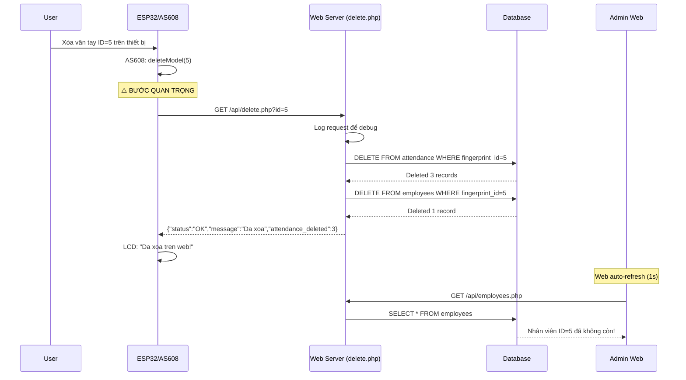
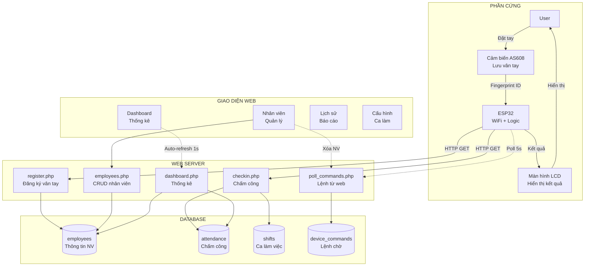
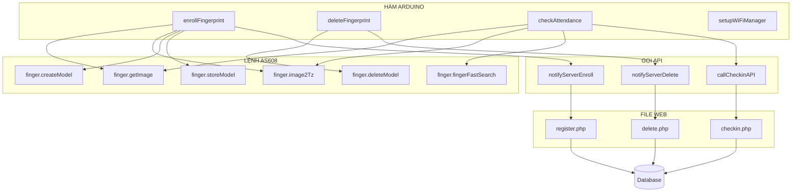

# ÔN TẬP - HỆ THỐNG CHẤM CÔNG VÂN TAY

## 📌 TỔNG QUAN HỆ THỐNG

Hệ thống bao gồm 2 phần:
1. **Phần cứng**: ESP32 + Cảm biến vân tay AS608
2. **Phần mềm**: Web Application (PHP + MySQL + JavaScript)

---

## 🔥 CHỨC NĂNG 1: ĐĂNG KÝ VÂN TAY MỚI

### A. Phần Cứng (Arduino/ESP32)
**Quy trình:**
1. User nhấn nút "Đăng ký vân tay" trên thiết bị
2. ESP32 yêu cầu user đặt ngón tay lên AS608
3. AS608 quét và lưu vân tay vào bộ nhớ với ID (ví dụ: ID = 5)
4. ESP32 gọi API đăng ký: `GET /api/register.php?id=5&dept=IT`

**Code Arduino (giả định):**
```cpp
// Hàm đăng ký vân tay
void registerFingerprint() {
  int id = finger.getNextFreeID(); // Tìm ID trống
  
  // Quét vân tay 2 lần để xác nhận
  if (finger.getImage() == FINGERPRINT_OK) {
    if (finger.image2Tz(1) == FINGERPRINT_OK) {
      // Quét lần 2
      if (finger.getImage() == FINGERPRINT_OK) {
        if (finger.image2Tz(2) == FINGERPRINT_OK) {
          // Tạo model và lưu
          if (finger.createModel() == FINGERPRINT_OK) {
            if (finger.storeModel(id) == FINGERPRINT_OK) {
              // Gửi lên server
              sendToServer(id);
            }
          }
        }
      }
    }
  }
}

void sendToServer(int fingerId) {
  String url = "http://server.com/api/register.php?id=" + String(fingerId) + "&dept=" + DEVICE_CODE;
  http.begin(url);
  int httpCode = http.GET();
  String response = http.getString();
  // Hiển thị kết quả trên LCD
}
```

### B. Phần Mềm (Web)

#### File: `api/register.php`
**Chức năng:** Nhận ID vân tay mới từ ESP32 và tạo bản ghi tạm thời

**Code xử lý:**
```php
// 1. Nhận ID từ ESP32
$fingerId = (int)$_GET['id'];
$deptCode = $_GET['dept'] ?? 'Chờ cập nhật';

// 2. Kiểm tra ID đã tồn tại chưa
$stmt = $pdo->prepare("SELECT id FROM employees WHERE fingerprint_id = ?");
$stmt->execute([$fingerId]);

if ($stmt->fetch()) {
    // ID đã tồn tại
    json_response(['message' => 'ID đã tồn tại']);
} else {
    // 3. Tạo nhân viên mới với thông tin tạm
    $tempName = "Nhân viên mới #" . $fingerId;
    
    // 4. Map device_code sang tên phòng ban
    $deptName = mapDeviceCodeToDeptName($deptCode);
    
    // 5. INSERT vào database
    $stmt = $pdo->prepare("INSERT INTO employees (fingerprint_id, full_name, department, position) VALUES (?, ?, ?, ?)");
    $stmt->execute([$fingerId, $tempName, $deptName, 'Nhân viên']);
}
```

**Bảng `employees` sau khi đăng ký:**
| id | fingerprint_id | full_name | department | position |
|----|---------------|-----------|------------|----------|
| 1  | 5             | Nhân viên mới #5 | IT | Nhân viên |

#### File: `public/assets/app.js` - Hoàn thiện thông tin
**Chức năng:** Admin vào web để cập nhật thông tin đầy đủ cho nhân viên mới

**Code xử lý:**
```javascript
// 1. Load danh sách nhân viên pending (chờ cập nhật)
async function openCompleteFingerprintEmployee() {
  // Gọi API lấy nhân viên có tên "Nhân viên mới #..."
  const res = await fetch(`${api.employees}?pending=1`);
  const pending = await res.json();
  
  // 2. Hiển thị modal với dropdown chọn nhân viên
  // 3. Admin chọn và điền thông tin: Họ tên, Phòng ban, Chức vụ, Ngày sinh
  // 4. Submit form
  
  const payload = {
    id: employeeId,
    full_name: "Nguyễn Văn A",
    department: "IT",
    position: "Developer",
    birth_year: "19900115"
  };
  
  // 5. Gọi API cập nhật
  await fetch(api.employees, {
    method: "PUT",
    body: JSON.stringify(payload)
  });
}
```

#### File: `api/employees.php` - Cập nhật thông tin
```php
case 'PUT':
    $payload = read_json_body();
    
    // Cập nhật thông tin nhân viên
    $stmt = $pdo->prepare("UPDATE employees SET full_name = ?, department = ?, position = ?, birth_year = ? WHERE id = ?");
    $stmt->execute([
        $payload['full_name'],
        $payload['department'], 
        $payload['position'],
        $payload['birth_year'],
        $payload['id']
    ]);
```

### C. Sơ Đồ Luồng Đăng Ký Vân Tay



---

## 🔥 CHỨC NĂNG 2: CHẤM CÔNG (CHECK IN/OUT)

### A. Phần Cứng (Arduino/ESP32)

**Code Arduino:**
```cpp
void checkAttendance() {
  // 1. Quét vân tay
  if (finger.getImage() == FINGERPRINT_OK) {
    if (finger.image2Tz() == FINGERPRINT_OK) {
      // 2. Tìm kiếm vân tay trong database AS608
      if (finger.fingerFastSearch() == FINGERPRINT_OK) {
        int foundID = finger.fingerID;
        
        // 3. Gọi API chấm công
        String url = "http://server.com/api/checkin.php?finger_id=" + String(foundID);
        http.begin(url);
        int httpCode = http.GET();
        
        // 4. Parse JSON response
        String response = http.getString();
        // {"status":"OK", "name":"Nguyễn Văn A", "action":"CHECK IN"}
        
        // 5. Hiển thị trên LCD
        lcd.print(response.name);
        lcd.print(" - " + response.action);
      }
    }
  }
}
```

### B. Phần Mềm (Web)

#### File: `api/checkin.php`
**Chức năng:** Xử lý chấm công tự động, xác định CHECK IN/OUT, tính trạng thái

**Code xử lý chi tiết:**

```php
// 1. Nhận finger_id từ ESP32
$fid = (int)$_GET['finger_id'];
$today = date('Y-m-d');
$now = date('H:i:s');

// 2. Tìm nhân viên
$stmt = $pdo->prepare("SELECT full_name FROM employees WHERE fingerprint_id = ?");
$stmt->execute([$fid]);
$user = $stmt->fetch();

if (!$user) {
    json_response(['status' => 'ERROR', 'message' => 'Chua dang ky']);
}

// 3. Lấy danh sách ca làm việc
$shifts = $pdo->query("SELECT id, shift_name, start_time, end_time FROM shifts ORDER BY start_time ASC")->fetchAll();

// 4. Hàm xác định ca hiện tại
function selectShiftForNow($shifts, $currentTime) {
    // Đang trong ca?
    foreach ($shifts as $shift) {
        if ($currentTime >= $shift['start_time'] && $currentTime <= $shift['end_time']) {
            return $shift;
        }
    }
    // Chưa tới giờ -> lấy ca sắp tới
    foreach ($shifts as $shift) {
        if ($currentTime < $shift['start_time']) {
            return $shift;
        }
    }
    // Sau ca cuối -> dùng ca cuối
    return end($shifts);
}

// 5. Kiểm tra đã có bản ghi chưa checkout
$stmt = $pdo->prepare("
    SELECT a.id, a.check_in, a.check_out, a.status, s.start_time, s.end_time
    FROM attendance a
    JOIN shifts s ON s.id = a.shift_id
    WHERE a.fingerprint_id = ? AND a.date = ? AND a.check_out IS NULL
    LIMIT 1
");
$stmt->execute([$fid, $today]);
$log = $stmt->fetch();

if ($log) {
    // ĐÃ CÓ CHECK IN -> Cập nhật CHECK OUT
    $isEarlyLeave = $now < $log['end_time'];
    $status = $log['status'];
    
    if ($isEarlyLeave && stripos($status, 'Về sớm') === false) {
        $status = $status . ' - Về sớm';
    }
    
    $pdo->prepare("UPDATE attendance SET check_out = ?, status = ? WHERE id = ?")->execute([$now, $status, $log['id']]);
    $action = "CHECK OUT";
    
} else {
    // CHƯA CÓ CHECK IN -> Tạo mới
    $shift = selectShiftForNow($shifts, $now);
    
    // Xác định trạng thái: Đúng giờ / Đi muộn
    $status = ($now <= $shift['start_time']) ? 'Đúng giờ' : 'Đi muộn';
    
    $pdo->prepare("INSERT INTO attendance (fingerprint_id, shift_id, date, check_in, status) VALUES (?, ?, ?, ?, ?)")->execute([$fid, $shift['id'], $today, $now, $status]);
    $action = "CHECK IN";
}

// 6. Trả về JSON
json_response([
    'status' => 'OK',
    'name' => $user['full_name'],
    'action' => $action
]);
```

### C. Sơ Đồ Luồng Chấm Công



### D. Ví Dụ Cụ Thể

**Scenario 1: Check In Đúng Giờ**
- Ca sáng: 08:00 - 17:00
- User chấm công lúc 7:55
- Kết quả: `status = "Đúng giờ"`, `check_in = 07:55:00`

**Scenario 2: Check In Đi Muộn**
- Ca sáng: 08:00 - 17:00
- User chấm công lúc 8:15
- Kết quả: `status = "Đi muộn"`, `check_in = 08:15:00`

**Scenario 3: Check Out Về Sớm**
- Ca sáng: 08:00 - 17:00
- Check in lúc 8:15 (Đi muộn)
- Check out lúc 16:30
- Kết quả: `status = "Đi muộn - Về sớm"`, `check_out = 16:30:00`

---

## 🔥 CHỨC NĂNG 3: XÓA VÂN TAY

> **⚠️ LƯU Ý QUAN TRỌNG**: Có 2 cách xóa vân tay trong hệ thống này!

### A. Tổng Quan 2 Cách Xóa

#### **Cách 1: Xóa Từ Web Admin** (Đồng bộ 2 chiều)
- Admin xóa trên web
- Web tạo lệnh trong `device_commands`  
- ESP32 poll lệnh và xóa khỏi AS608
- ESP32 confirm → Web xóa database

#### **Cách 2: Xóa Từ Phần Cứng** (Xóa trực tiếp)
- User xóa vân tay trên thiết bị AS608
- **Arduino PHẢI GỌI API** `GET /api/delete.php?id=X`
- Server xóa trực tiếp khỏi database
- Web auto-refresh sẽ thấy nhân viên biến mất

---

### B. CÁCH 1: XÓA TỪ WEB (Đồng Bộ 2 Chiều)

#### Bước 1: Admin xóa nhân viên trên web

**File: `public/assets/app.js`**
```javascript
async function deleteEmployee(id) {
  if (!confirm("Xóa nhân viên này?")) return;
  
  // Gọi API xóa (tạo lệnh chờ)
  const res = await fetch(`${apiBase}/delete.php`, {
    method: "POST",
    body: JSON.stringify({ id: id })
  });
  
  const result = await res.json();
  alert(result.message); // "Đã gửi lệnh xóa xuống thiết bị..."
}
```

**File: `api/delete.php` - Xử lý POST request**
```php
// POST/DELETE method - Xóa từ web
if ($_SERVER['REQUEST_METHOD'] === 'POST' || $_SERVER['REQUEST_METHOD'] === 'DELETE') {
    $employeeId = $data['id'];
    
    // 1. Lấy thông tin nhân viên
    $stmt = $pdo->prepare("SELECT fingerprint_id, department FROM employees WHERE id = ?");
    $stmt->execute([$employeeId]);
    $employee = $stmt->fetch();
    
    $fingerId = $employee['fingerprint_id'];
    $deptName = $employee['department'];
    
    // 2. Map department NAME sang device_code
    $deviceCode = mapDeptNameToDeviceCode($deptName); // IT, KETOAN, ...
    
    // 3. TẠO LỆNH XÓA trong queue (CHƯA xóa database)
    $sql = "INSERT INTO device_commands (device_dept, command, data, status) VALUES (?, 'DELETE', ?, 'pending')";
    $stmt = $pdo->prepare($sql);
    $stmt->execute([$deviceCode, $fingerId]);
    
    // 4. Trả về thông báo
    echo json_encode(['status' => 'success', 'message' => 'Đã gửi lệnh xóa xuống thiết bị']);
}
```

**Bảng `device_commands` sau khi tạo lệnh:**
| id | device_dept | command | data | status |
|----|-------------|---------|------|--------|
| 1  | IT          | DELETE  | 5    | pending |

#### Bước 2: ESP32 poll lệnh từ server

**Code Arduino:**
```cpp
void pollCommands() {
  // 1. Gọi API để lấy lệnh pending
  String url = "http://server.com/api/poll_commands.php?dept=" + DEVICE_CODE; // dept=IT
  http.begin(url);
  int httpCode = http.GET();
  String response = http.getString();
  
  // Parse JSON: {"has_cmd":true, "cmd_id":1, "type":"DELETE", "fid":5}
  
  if (response.has_cmd) {
    int cmdId = response.cmd_id;
    int fingerIdToDelete = response.fid;
    
    // 2. Xóa vân tay khỏi AS608
    if (finger.deleteModel(fingerIdToDelete) == FINGERPRINT_OK) {
      // 3. Báo hoàn tất cho server
      confirmDelete(cmdId);
    }
  }
}

void confirmDelete(int cmdId) {
  String url = "http://server.com/api/poll_commands.php?done_id=" + String(cmdId);
  http.begin(url);
  http.GET();
  // Server sẽ XÓA khỏi database khi nhận được done_id
}
```

#### Bước 3: Server nhận xác nhận và xóa database

**File: `api/poll_commands.php`**
```php
// ESP32 REPORTS COMPLETION
if (isset($_GET['done_id'])) {
    $cmdId = (int)$_GET['done_id'];
    
    // 1. Lấy thông tin lệnh
    $stmt = $pdo->prepare("SELECT * FROM device_commands WHERE id = ?");
    $stmt->execute([$cmdId]);
    $cmd = $stmt->fetch();
    
    if ($cmd && $cmd['command'] === 'DELETE') {
        $fingerId = (int)$cmd['data'];
        
        // 2. Xóa attendance trước (vì có thể chưa có CASCADE)
        $pdo->prepare("DELETE FROM attendance WHERE fingerprint_id = ?")->execute([$fingerId]);
        
        // 3. Xóa employee
        $pdo->prepare("DELETE FROM employees WHERE fingerprint_id = ?")->execute([$fingerId]);
        
        // 4. Xóa lệnh khỏi queue
        $pdo->prepare("DELETE FROM device_commands WHERE id = ?")->execute([$cmdId]);
        
        echo json_encode(['status' => 'ok', 'message' => 'Deleted']);
    }
}
```

---

### C. CÁCH 2: XÓA TỪ PHẦN CỨNG (⚠️ QUAN TRỌNG!)

> **🔴 VẤN ĐỀ THƯỜNG GẶP**: Xóa vân tay trên AS608 nhưng web KHÔNG XÓA!
> 
> **NGUYÊN NHÂN**: Arduino CHƯA GỌI API để thông báo cho server!

#### Arduino PHẢI GỌI API Khi Xóa Vân Tay

**Code Arduino (QUAN TRỌNG):**
```cpp
void deleteFingerprint(int id) {
  // 1. Xóa vân tay khỏi AS608
  if (finger.deleteModel(id) == FINGERPRINT_OK) {
    Serial.println("Deleted from sensor: " + String(id));
    
    // 2. ⚠️ QUAN TRỌNG: Phải gọi API để xóa khỏi database
    if (WiFi.status() == WL_CONNECTED) {
      HTTPClient http;
      
      // Thay IP này bằng IP server
      String url = "http://192.168.1.100/chamcongv2/api/delete.php?id=" + String(id);
      
      Serial.println("Calling API: " + url);
      
      http.begin(url);
      int httpCode = http.GET();
      String response = http.getString();
      http.end();
      
      Serial.println("Response: " + response);
      // Response: {"status":"OK","message":"Da xoa","fingerprint_id":5,"attendance_deleted":3}
      
      if (response.indexOf("\"status\":\"OK\"") > 0) {
        lcd.print("Da xoa tren web!");
      } else {
        lcd.print("Loi xoa web!");
      }
    } else {
      lcd.print("Loi WiFi!");
    }
    
    lcd.print("Da xoa ID " + String(id));
  }
}
```

#### Server Xử Lý Xóa Trực Tiếp

**File: `api/delete.php` - Xử lý GET request**
```php
// GET method - Xóa từ Arduino
if ($_SERVER['REQUEST_METHOD'] === 'GET' && isset($_GET['id'])) {
    $fingerprintId = (int)$_GET['id'];
    
    try {
        // Log request để debug
        error_log("Arduino DELETE request: fingerprint_id = $fingerprintId");
        
        // QUAN TRỌNG: Xóa attendance TRƯỚC (tránh lỗi foreign key)
        $stmtAtt = $pdo->prepare("DELETE FROM attendance WHERE fingerprint_id = ?");
        $stmtAtt->execute([$fingerprintId]);
        $attendanceDeleted = $stmtAtt->rowCount();
        error_log("Deleted $attendanceDeleted attendance records");
        
        // Sau đó xóa employee
        $stmt = $pdo->prepare("DELETE FROM employees WHERE fingerprint_id = ?");
        $stmt->execute([$fingerprintId]);
        
        if ($stmt->rowCount() > 0) {
            error_log("Successfully deleted employee with fingerprint_id = $fingerprintId");
            echo json_encode([
                'status' => 'OK',
                'message' => 'Da xoa',
                'fingerprint_id' => $fingerprintId,
                'attendance_deleted' => $attendanceDeleted
            ]);
        } else {
            error_log("Employee not found: $fingerprintId");
            echo json_encode(['status' => 'ERROR', 'message' => 'Khong tim thay']);
        }
    } catch (Exception $e) {
        error_log("Error deleting: " . $e->getMessage());
        echo json_encode(['status' => 'ERROR', 'message' => 'Loi: ' . $e->getMessage()]);
    }
    exit();
}
```

**Điểm quan trọng:**
1. ✅ Xóa `attendance` TRƯỚC để tránh lỗi foreign key
2. ✅ Có error logging để debug
3. ✅ Response format chuẩn cho Arduino
4. ✅ Try-catch để bắt lỗi

---

### D. Sơ Đồ So Sánh 2 Cách Xóa

#### Sơ Đồ 1: Xóa Từ Web (Đồng Bộ 2 Chiều)



#### Sơ Đồ 2: Xóa Từ Phần Cứng (Xóa Trực Tiếp)



---

### E. Troubleshooting - Xóa Không Hoạt Động

#### ❌ Triệu chứng
Xóa vân tay từ AS608 nhưng thông tin trên web KHÔNG BỊ XÓA.

#### 🔍 Debug Steps

**Bước 1: Kiểm tra Arduino có gọi API không**

Mở trang monitor:
```
http://localhost/chamcongv2/monitor_delete.php
```

Trang này sẽ hiển thị REAL-TIME mọi request đến `delete.php`.

**Test:**
1. Mở monitor
2. Xóa vân tay ID=5 trên AS608
3. Xem có request xuất hiện không?

**Kết quả:**
- ✅ **CÓ request** → Arduino đã gọi API, check response
- ❌ **KHÔNG có request** → Arduino CHƯA gọi API (xem Bước 2)

**Bước 2: Thêm code vào Arduino**

Nếu monitor KHÔNG hiển thị request, Arduino thiếu code gọi API!

Thêm hàm này vào Arduino:
```cpp
void notifyServerDelete(int fingerprintId) {
  if (WiFi.status() != WL_CONNECTED) {
    Serial.println("❌ WiFi not connected!");
    return;
  }
  
  HTTPClient http;
  String url = SERVER_URL + "/api/delete.php?id=" + String(fingerprintId);
  
  Serial.println("🔥 Deleting from server: " + url);
  
  http.begin(url);
  int httpCode = http.GET();
  String response = http.getString();
  http.end();
  
  Serial.println("Response (" + String(httpCode) + "): " + response);
}

// Gọi hàm này NGAY SAU khi xóa vân tay khỏi AS608
void deleteFingerprint(int id) {
  if (finger.deleteModel(id) == FINGERPRINT_OK) {
    Serial.println("✅ Deleted from AS608: " + String(id));
    
    // ⚠️ QUAN TRỌNG: Gọi API
    notifyServerDelete(id);
    
    lcd.print("Da xoa ID " + String(id));
  }
}
```

**Bước 3: Check log file**

Xem file `chamcongv2/delete_requests.log` để xem request history.

**Bước 4: Test API thủ công**

Test trực tiếp từ browser:
```
http://localhost/chamcongv2/test_delete.php?id=5
```

Nếu test OK → Vấn đề ở Arduino
Nếu test FAIL → Vấn đề ở PHP code

#### 🛠️ Debug Tools

| Tool | URL | Mục đích |
|------|-----|----------|
| Debug Dashboard | `http://localhost/chamcongv2/debug.php` | Tổng hợp tất cả tools |
| Request Monitor | `http://localhost/chamcongv2/monitor_delete.php` | Theo dõi real-time |
| Test Delete | `http://localhost/chamcongv2/test_delete.php?id=X` | Test thủ công |

#### 📝 Checklist Debug

- [ ] Mở monitor: `http://localhost/chamcongv2/monitor_delete.php`
- [ ] Xóa vân tay từ AS608
- [ ] Xem có request trong monitor không?
- [ ] Nếu KHÔNG → Thêm code gọi API vào Arduino
- [ ] Nếu CÓ → Check response có `"status":"OK"` không
- [ ] Check Serial Monitor Arduino để xem debug log
- [ ] Test API thủ công với `test_delete.php`
- [ ] Check file log: `chamcongv2/delete_requests.log`

---

## 🔥 CHỨC NĂNG 4: HIỂN thị DASHBOARD

### A. Phần Mềm (Web)

#### File: `api/dashboard.php`
```php
// 1. Đếm tổng nhân viên
$totalEmployees = $pdo->query("SELECT COUNT(*) FROM employees")->fetchColumn();

// 2. Đếm người có mặt hôm nay
$today = date('Y-m-d');
$present = $pdo->prepare("SELECT COUNT(DISTINCT fingerprint_id) FROM attendance WHERE date = ?");
$present->execute([$today]);
$presentCount = $present->fetchColumn();

// 3. Đếm người đi muộn
$late = $pdo->prepare("SELECT COUNT(*) FROM attendance WHERE date = ? AND status LIKE '%muộn%'");
$late->execute([$today]);
$lateCount = $late->fetchColumn();

// 4. Tính người nghỉ
$absent = $totalEmployees - $presentCount;

// 5. Lấy danh sách chấm công hôm nay
$logs = $pdo->prepare("
    SELECT e.full_name, e.department, a.check_in, a.check_out, a.status, s.shift_name
    FROM attendance a
    JOIN employees e ON e.fingerprint_id = a.fingerprint_id
    JOIN shifts s ON s.id = a.shift_id
    WHERE a.date = ?
    ORDER BY a.check_in DESC
");
$logs->execute([$today]);

echo json_encode([
    'cards' => [
        'totalEmployees' => $totalEmployees,
        'present' => $presentCount,
        'late' => $lateCount,
        'absent' => $absent
    ],
    'todayLogs' => $logs->fetchAll()
]);
```

#### File: `public/assets/app.js`
```javascript
async function loadDashboard() {
  const res = await fetch(api.dashboard);
  const data = await res.json();
  
  // 1. Render cards thống kê
  document.getElementById("stats-cards").innerHTML = `
    <div class="card">Tổng nhân viên: ${data.cards.totalEmployees}</div>
    <div class="card">Đi làm: ${data.cards.present}</div>
    <div class="card">Đi muộn: ${data.cards.late}</div>
    <div class="card">Nghỉ: ${data.cards.absent}</div>
  `;
  
  // 2. Render bảng chấm công hôm nay
  document.getElementById("today-logs").innerHTML = data.todayLogs.map(row => `
    <tr>
      <td>${row.full_name}</td>
      <td>${row.department}</td>
      <td>${row.shift_name}</td>
      <td>${row.check_in}</td>
      <td>${row.check_out || '-'}</td>
      <td>${statusBadge(row.status)}</td>
    </tr>
  `).join('');
}

// Auto-refresh mỗi 1 giây
setInterval(loadDashboard, 1000);
```

---

## 🔥 CHỨC NĂNG 5: QUẢN LÝ PHÒNG BAN VÀ DEVICE_CODE

### A. Tại Sao Cần Device Code?

**Vấn đề:**
- Web lưu tên phòng ban tiếng Việt: "Kế Toán", "Nhân Sự"
- Arduino chỉ gửi mã ngắn: "IT", "KETOAN", "HR"

**Giải pháp:**
- Bảng mapping trong `api/departments.json`
- Mỗi phòng ban có: `name` (cho web) và `device_code` (cho hardware)

**File: `api/departments.json`**
```json
[
  {"id": 1, "name": "Kế Toán", "device_code": "KETOAN"},
  {"id": 2, "name": "Nhân Sự", "device_code": "HR"},
  {"id": 3, "name": "IT", "device_code": "IT"}
]
```

### B. Mapping Trong register.php

```php
// ESP32 gửi: dept=KETOAN
$deptCode = $_GET['dept']; // "KETOAN"

// Đọc file JSON
$depts = json_decode(file_get_contents(__DIR__ . '/departments.json'), true);

// Tìm department có device_code = "KETOAN"
foreach ($depts as $d) {
    if ($d['device_code'] === $deptCode) {
        $deptName = $d['name']; // "Kế Toán"
        break;
    }
}

// Lưu vào database với tên tiếng Việt
INSERT INTO employees (..., department) VALUES (..., 'Kế Toán');
```

### C. Mapping Trong delete.php

```php
// Lấy từ database: department = "Kế Toán"
$deptName = $employee['department'];

// Map ngược lại sang device_code
foreach ($depts as $d) {
    if ($d['name'] === $deptName) {
        $deviceCode = $d['device_code']; // "KETOAN"
        break;
    }
}

// Tạo lệnh với device_code
INSERT INTO device_commands (device_dept, ...) VALUES ('KETOAN', ...);
```

---

## 📊 SƠ ĐỒ TỔNG QUAN HỆ THỐNG



---

## 🎯 TÓM TẮT CÁC FILE QUAN TRỌNG

| File | Chức năng | Gọi từ | Thao tác DB |
|------|-----------|--------|-------------|
| `api/register.php` | Đăng ký vân tay mới | ESP32 | INSERT employees |
| `api/checkin.php` | Chấm công IN/OUT | ESP32 | INSERT/UPDATE attendance |
| `api/poll_commands.php` | Poll lệnh + Confirm | ESP32 | SELECT/DELETE device_commands, DELETE employees |
| `api/delete.php` | Tạo lệnh xóa | Web Admin | INSERT device_commands |
| `api/employees.php` | CRUD nhân viên | Web Admin | SELECT/INSERT/UPDATE employees |
| `api/dashboard.php` | Thống kê | Web Auto-refresh | SELECT từ tất cả bảng |
| `public/assets/app.js` | Logic frontend | Browser | Gọi tất cả APIs |

---

## ⚡ CÁC ĐIỂM ĐẶC BIỆT

### 1. Tại sao không xóa trực tiếp database?
- Vì vân tay còn lưu trong AS608
- Nếu xóa database trước, ESP32 không biết phải xóa ID nào
- Phải xóa AS608 trước, rồi mới xóa database

### 2. Auto-refresh hoạt động như thế nào?
```javascript
setInterval(() => {
  if (currentSection === 'dashboard') loadDashboard();
}, 1000); // Mỗi 1 giây
```

### 3. Làm sao biết Check IN hay Check OUT?
- Kiểm tra bản ghi ngày hôm nay:
  - `check_out IS NULL` → Cập nhật CHECK OUT
  - Không có bản ghi → Tạo mới CHECK IN

### 4. Badge màu status
```javascript
function statusBadge(status) {
  if (status.includes('về sớm')) return '<span class="badge danger">' + status + '</span>';
  if (status.includes('muộn')) return '<span class="badge warn">' + status + '</span>';
  if (status.includes('đúng giờ')) return '<span class="badge success">' + status + '</span>';
}
```

---

## 🔧 PHẦN ARDUINO/ESP32 - PHẦN CỨNG

### A. HIỂN THỊ THÔNG TIN HỆ THỐNG

#### 1. Làm Sao Biết Đang Kết Nối Mạng Nào?

**Sử dụng thư viện WiFi của ESP32:**

```cpp
#include <WiFi.h>

void displayWiFiInfo() {
  // 1. Lấy tên WiFi đang kết nối (SSID)
  String ssid = WiFi.SSID();
  
  // 2. Lấy địa chỉ IP
  String ip = WiFi.localIP().toString();
  
  // 3. Lấy cường độ tín hiệu (RSSI)
  int rssi = WiFi.RSSI();
  
  // 4. Hiển thị trên LCD
  lcd.clear();
  lcd.setCursor(0, 0);
  lcd.print("WiFi: " + ssid);
  lcd.setCursor(0, 1);
  lcd.print("IP: " + ip);
  lcd.setCursor(0, 2);
  lcd.print("Signal: " + String(rssi) + " dBm");
  
  // 5. In ra Serial Monitor
  Serial.println("=== WiFi Info ===");
  Serial.println("SSID: " + ssid);
  Serial.println("IP: " + ip);
  Serial.println("RSSI: " + String(rssi) + " dBm");
  Serial.println("MAC: " + WiFi.macAddress());
}
```

**Ý nghĩa:**
- `WiFi.SSID()` → Trả về tên mạng WiFi đang kết nối (VD: "FPT_Telecom")
- `WiFi.localIP()` → Trả về IP address (VD: 192.168.1.100)
- `WiFi.RSSI()` → Cường độ tín hiệu (-50 = tốt, -80 = yếu)
- `WiFi.macAddress()` → Địa chỉ MAC của ESP32

#### 2. Làm Sao Biết Đã Chạy Bao Lâu?

**Sử dụng hàm millis():**

```cpp
void displayUptime() {
  // 1. Lấy thời gian đã chạy (milliseconds)
  unsigned long uptimeMs = millis();
  
  // 2. Chuyển đổi sang giờ:phút:giây
  unsigned long seconds = uptimeMs / 1000;
  unsigned long minutes = seconds / 60;
  unsigned long hours = minutes / 60;
  unsigned long days = hours / 24;
  
  seconds = seconds % 60;
  minutes = minutes % 60;
  hours = hours % 24;
  
  // 3. Hiển thị trên LCD
  lcd.clear();
  lcd.print("Uptime:");
  lcd.setCursor(0, 1);
  
  if (days > 0) {
    lcd.print(String(days) + "d " + String(hours) + "h");
  } else if (hours > 0) {
    lcd.print(String(hours) + "h " + String(minutes) + "m");
  } else {
    lcd.print(String(minutes) + "m " + String(seconds) + "s");
  }
  
  // 4. In ra Serial
  Serial.println("Uptime: " + String(days) + "d " + String(hours) + "h " + 
                 String(minutes) + "m " + String(seconds) + "s");
}
```

**Lưu ý:**
- `millis()` đếm từ khi ESP32 bật nguồn
- Tràn số sau ~49 ngày (giới hạn unsigned long)
- Không bị ảnh hưởng bởi delay() hay sleep

#### 3. Hiển Thị Tổng Hợp

**Menu thông tin hệ thống:**

```cpp
void showSystemInfo() {
  lcd.clear();
  lcd.setCursor(0, 0);
  lcd.print("=== HE THONG ===");
  
  // WiFi Status
  if (WiFi.status() == WL_CONNECTED) {
    lcd.setCursor(0, 1);
    lcd.print("WiFi: " + String(WiFi.SSID()));
    lcd.setCursor(0, 2);
    lcd.print("IP: " + WiFi.localIP().toString());
  } else {
    lcd.setCursor(0, 1);
    lcd.print("WiFi: DISCONNECTED");
  }
  
  // Uptime
  unsigned long seconds = millis() / 1000;
  unsigned long minutes = seconds / 60;
  unsigned long hours = minutes / 60;
  lcd.setCursor(0, 3);
  lcd.print("Uptime: " + String(hours) + "h " + String(minutes % 60) + "m");
}
```

---

### B. CHỨC NĂNG THÊM VÂN TAY

#### Arduino - Các Hàm Liên Quan

**File Arduino: `.ino` (Main Sketch)**

##### 1. Hàm Chính: enrollFingerprint()

```cpp
#include <Adafruit_Fingerprint.h>

Adafruit_Fingerprint finger = Adafruit_Fingerprint(&Serial2);

int enrollFingerprint() {
  // 1. Tìm ID trống
  int id = getNextFreeID();
  
  if (id == -1) {
    lcd.print("Bo nho day!");
    return -1;
  }
  
  lcd.print("Dat ngon tay #" + String(id));
  Serial.println("Enrolling ID #" + String(id));
  
  // 2. Quét vân tay lần 1
  if (!captureFinger(1)) return -1;
  
  lcd.print("Nha tay ra...");
  delay(2000);
  
  // 3. Quét vân tay lần 2
  lcd.print("Dat lai lan 2");
  if (!captureFinger(2)) return -1;
  
  // 4. Tạo model và lưu
  if (createAndStoreModel(id)) {
    // 5. Gửi lên server
    notifyServerEnroll(id);
    return id;
  }
  
  return -1;
}
```

##### 2. Hàm Phụ: getNextFreeID()

```cpp
int getNextFreeID() {
  // Tìm ID trống đầu tiên từ 1-127
  for (int id = 1; id <= 127; id++) {
    if (finger.loadModel(id) != FINGERPRINT_OK) {
      return id; // ID này trống
    }
  }
  return -1; // Bộ nhớ đầy
}
```

**Chức năng:**
- Duyệt từ ID 1 đến 127
- Thử load model, nếu lỗi → ID trống
- Trả về ID đầu tiên trống

##### 3. Hàm Phụ: captureFinger()

```cpp
bool captureFinger(int imageSlot) {
  int p = -1;
  
  // Đợi đặt tay
  while (p != FINGERPRINT_OK) {
    p = finger.getImage();
    if (p == FINGERPRINT_NOFINGER) {
      // Chưa có tay, đợi tiếp
    } else if (p == FINGERPRINT_OK) {
      Serial.println("Image captured!");
      break;
    } else {
      Serial.println("Error capturing image");
      return false;
    }
  }
  
  // Chuyển ảnh thành template
  p = finger.image2Tz(imageSlot);
  if (p != FINGERPRINT_OK) {
    Serial.println("Error converting image");
    return false;
  }
  
  return true;
}
```

**Chức năng:**
- `getImage()` → Chụp ảnh vân tay
- `image2Tz(slot)` → Chuyển ảnh thành template (slot 1 hoặc 2)
- Template lưu tạm trong RAM

##### 4. Hàm Phụ: createAndStoreModel()

```cpp
bool createAndStoreModel(int id) {
  // Tạo model từ 2 template
  int p = finger.createModel();
  if (p != FINGERPRINT_OK) {
    Serial.println("Error creating model");
    lcd.print("Loi! Thu lai");
    return false;
  }
  
  // Lưu model vào FLASH (vị trí = id)
  p = finger.storeModel(id);
  if (p != FINGERPRINT_OK) {
    Serial.println("Error storing model");
    lcd.print("Loi luu!");
    return false;
  }
  
  Serial.println("Stored successfully at ID #" + String(id));
  lcd.print("Luu thanh cong!");
  return true;
}
```

**Chức năng:**
- `createModel()` → So sánh 2 template, tạo model chính xác
- `storeModel(id)` → Lưu model vào FLASH tại vị trí `id`
- FLASH = bộ nhớ vĩnh viễn (không mất khi tắt nguồn)

##### 5. Hàm Gọi API: notifyServerEnroll()

```cpp
void notifyServerEnroll(int fingerprintId) {
  if (WiFi.status() != WL_CONNECTED) {
    Serial.println("WiFi not connected!");
    return;
  }
  
  HTTPClient http;
  String url = SERVER_URL + "/api/register.php?id=" + String(fingerprintId) + 
               "&dept=" + DEVICE_CODE;
  
  Serial.println("Calling: " + url);
  
  http.begin(url);
  int httpCode = http.GET();
  String response = http.getString();
  http.end();
  
  Serial.println("Response: " + response);
  
  // Parse response và hiển thị
  if (response.indexOf("\"message\"") > 0) {
    lcd.print("Da gui len web!");
  }
}
```

**Chức năng:**
- Gọi `GET /api/register.php?id=X&dept=IT`
- Tạo nhân viên tạm trong database
- Admin sau đó hoàn thiện thông tin trên web

#### Web - File Xử Lý

**File: `api/register.php`**

```php
// Nhận ID từ ESP32
$fingerId = (int)$_GET['id'];
$deptCode = $_GET['dept'] ?? 'Chờ cập nhật';

// Map device_code sang tên phòng ban
$deptName = mapDeviceCodeToDeptName($deptCode);

// Tạo nhân viên tạm
$tempName = "Nhân viên mới #" . $fingerId;
$stmt = $pdo->prepare("INSERT INTO employees (fingerprint_id, full_name, department, position) VALUES (?, ?, ?, ?)");
$stmt->execute([$fingerId, $tempName, $deptName, 'Nhân viên']);

// Trả về JSON
echo json_encode(['message' => 'Đã tạo bản ghi chờ cập nhật cho ID ' . $fingerId]);
```

**Chức năng:**
- INSERT vào bảng `employees`
- Tạo bản ghi với thông tin tạm thời
- Admin vào web → Tab "Nhân viên" → Hoàn thiện thông tin

---

### C. CHỨC NĂNG XÓA VÂN TAY

#### Arduino - Các Hàm Liên Quan

##### 1. Hàm Chính: deleteFingerprint()

```cpp
void deleteFingerprint(int id) {
  lcd.print("Xoa ID #" + String(id) + "?");
  lcd.setCursor(0, 1);
  lcd.print("Nhan # de xac nhan");
  
  // Đợi xác nhận từ bàn phím
  if (!waitForConfirmation()) {
    lcd.print("Da huy");
    return;
  }
  
  // Xóa khỏi AS608
  int p = finger.deleteModel(id);
  
  if (p == FINGERPRINT_OK) {
    Serial.println("Deleted from AS608: ID #" + String(id));
    lcd.print("Da xoa khoi cam bien");
    
    // Gọi API để xóa khỏi database
    notifyServerDelete(id);
    
    lcd.setCursor(0, 3);
    lcd.print("Hoan tat!");
  } else {
    Serial.println("Error deleting from AS608");
    lcd.print("Loi xoa!");
  }
}
```

**Chức năng:**
- Xác nhận trước khi xóa
- `finger.deleteModel(id)` → Xóa khỏi FLASH của AS608
- Gọi API để đồng bộ database

##### 2. Hàm Gọi API: notifyServerDelete()

```cpp
void notifyServerDelete(int fingerprintId) {
  if (WiFi.status() != WL_CONNECTED) {
    Serial.println("WiFi not connected!");
    lcd.print("Loi WiFi, chua xoa web!");
    return;
  }
  
  HTTPClient http;
  String url = SERVER_URL + "/api/delete.php?id=" + String(fingerprintId);
  
  Serial.println("Deleting from server: " + url);
  
  http.begin(url);
  int httpCode = http.GET();
  String response = http.getString();
  http.end();
  
  Serial.println("Response (" + String(httpCode) + "): " + response);
  
  if (httpCode == 200 && response.indexOf("\"status\":\"OK\"") > 0) {
    lcd.print("Da xoa tren web!");
  } else {
    lcd.print("Loi xoa web!");
  }
}
```

**Chức năng:**
- Gọi `GET /api/delete.php?id=X`
- Server xóa khỏi database
- Response: `{"status":"OK","message":"Da xoa",...}`

#### Web - File Xử Lý

**File: `api/delete.php` (GET method)**

```php
if ($_SERVER['REQUEST_METHOD'] === 'GET' && isset($_GET['id'])) {
    $fingerprintId = (int)$_GET['id'];
    
    // Xóa attendance trước
    $pdo->prepare("DELETE FROM attendance WHERE fingerprint_id = ?")->execute([$fingerprintId]);
    
    // Xóa employee
    $stmt = $pdo->prepare("DELETE FROM employees WHERE fingerprint_id = ?");
    $stmt->execute([$fingerprintId]);
    
    echo json_encode(['status' => 'OK', 'message' => 'Da xoa']);
}
```/

**Chức năng:**
- Xóa bản ghi trong database
- Đồng bộ với AS608 (đã xóa trước đó)

---

### D. CHỨC NĂNG CHẤM CÔNG

#### Arduino - Các Hàm Liên Quan

##### 1. Hàm Chính: checkAttendance()

```cpp
void checkAttendance() {
  lcd.clear();
  lcd.print("Dat ngon tay...");
  
  // 1. Chụp ảnh vân tay
  int p = finger.getImage();
  if (p != FINGERPRINT_OK) {
    return; // Chưa có tay
  }
  
  // 2. Chuyển ảnh thành template
  p = finger.image2Tz();
  if (p != FINGERPRINT_OK) {
    lcd.print("Loi doc van tay!");
    return;
  }
  
  // 3. Tìm kiếm trong database AS608
  p = finger.fingerFastSearch();
  if (p != FINGERPRINT_OK) {
    lcd.print("Chua dang ky!");
    Serial.println("Fingerprint not found");
    return;
  }
  
  // 4. Lấy ID tìm được
  int foundID = finger.fingerID;
  int confidence = finger.confidence;
  
  Serial.println("Found ID #" + String(foundID) + " with confidence " + String(confidence));
  
  // 5. Gọi API chấm công
  callCheckinAPI(foundID);
}
```

**Chức năng:**
- `getImage()` → Chụp ảnh vân tay
- `image2Tz()` → Chuyển thành template
- `fingerFastSearch()` → Tìm khớp trong database
- `finger.fingerID` → ID tìm được
- `finger.confidence` → Độ chính xác (0-255, >50 là tốt)

##### 2. Hàm Gọi API: callCheckinAPI()

```cpp
void callCheckinAPI(int fingerId) {
  if (WiFi.status() != WL_CONNECTED) {
    lcd.print("Loi WiFi!");
    return;
  }
  
  HTTPClient http;
  String url = SERVER_URL + "/api/checkin.php?finger_id=" + String(fingerId);
  
  Serial.println("Checkin: " + url);
  
  http.begin(url);
  int httpCode = http.GET();
  String response = http.getString();
  http.end();
  
  Serial.println("Response: " + response);
  
  // Parse JSON response
  DynamicJsonDocument doc(512);
  deserializeJson(doc, response);
  
  String status = doc["status"];
  String name = doc["name"];
  String action = doc["action"];
  
  // Hiển thị kết quả
  lcd.clear();
  lcd.setCursor(0, 0);
  lcd.print(name);
  lcd.setCursor(0, 1);
  lcd.print(action);
  
  // Phát âm thanh xác nhận
  if (status == "OK") {
    tone(BUZZER_PIN, 1000, 200); // Beep ngắn
  }
  
  delay(3000); // Hiển thị 3 giây
}
```

**Chức năng:**
- Gọi `GET /api/checkin.php?finger_id=X`
- Parse JSON: `{"status":"OK","name":"Nguyễn Văn A","action":"CHECK IN"}`
- Hiển thị tên và hành động (CHECK IN/OUT)
- Beep xác nhận

#### Web - File Xử Lý

**File: `api/checkin.php`**

```php
$fid = (int)$_GET['finger_id'];
$today = date('Y-m-d');
$now = date('H:i:s');

// Tìm nhân viên
$user = $pdo->prepare("SELECT full_name FROM employees WHERE fingerprint_id = ?")->fetch();

// Lấy ca làm việc hiện tại
$shift = selectShiftForNow($shifts, $now);

// Kiểm tra đã check in chưa
$log = $pdo->prepare("SELECT * FROM attendance WHERE fingerprint_id = ? AND date = ? AND check_out IS NULL")->fetch();

if ($log) {
    // Đã có check in → Cập nhật check out
    $pdo->prepare("UPDATE attendance SET check_out = ? WHERE id = ?")->execute([$now, $log['id']]);
    $action = "CHECK OUT";
} else {
    // Chưa có → Tạo check in
    $status = ($now <= $shift['start_time']) ? 'Đúng giờ' : 'Đi muộn';
    $pdo->prepare("INSERT INTO attendance (fingerprint_id, shift_id, date, check_in, status) VALUES (?, ?, ?, ?, ?)")
        ->execute([$fid, $shift['id'], $today, $now, $status]);
    $action = "CHECK IN";
}

echo json_encode(['status' => 'OK', 'name' => $user['full_name'], 'action' => $action]);
```

---

### E. CẤU HÌNH WIFI QUA ĐIỆN THOẠI

#### Thư Viện Sử Dụng: WiFiManager

**Cài đặt:**
```
Arduino IDE → Library Manager → Search "WiFiManager" → Install
```

#### Code Arduino Đầy Đủ

```cpp
#include <WiFi.h>
#include <WiFiManager.h> // https://github.com/tzapu/WiFiManager

WiFiManager wifiManager;

void setup() {
  Serial.begin(115200);
  lcd.init();
  lcd.backlight();
  
  // 1. Thiết lập WiFiManager
  setupWiFiManager();
  
  // 2. Khởi động các module khác
  initFingerprint();
  initButtons();
}

void setupWiFiManager() {
  lcd.print("Dang ket noi WiFi...");
  
  // Reset settings (chỉ dùng khi debug)
  // wifiManager.resetSettings();
  
  // Thiết lập thông tin AP
  wifiManager.setAPCallback(configModeCallback);
  wifiManager.setSaveConfigCallback(saveConfigCallback);
  
  // Timeout 180 giây (3 phút)
  wifiManager.setConfigPortalTimeout(180);
  
  // Tên AccessPoint và mật khẩu
  String apName = "ChamCong_" + String(ESP.getEfuseMac(), HEX);
  String apPassword = "12345678";
  
  // Thử kết nối WiFi đã lưu, nếu không được thì mở Portal
  if (!wifiManager.autoConnect(apName.c_str(), apPassword.c_str())) {
    Serial.println("Failed to connect and hit timeout");
    lcd.print("Timeout! Khoi dong lai...");
    delay(3000);
    ESP.restart();
  }
  
  // Kết nối thành công
  Serial.println("Connected to WiFi!");
  Serial.println("IP: " + WiFi.localIP().toString());
  
  lcd.clear();
  lcd.print("WiFi: " + WiFi.SSID());
  lcd.setCursor(0, 1);
  lcd.print("IP: " + WiFi.localIP().toString());
  delay(3000);
}

// Callback khi vào chế độ config
void configModeCallback(WiFiManager *myWiFiManager) {
  Serial.println("Entered config mode");
  Serial.println("AP Name: " + String(myWiFiManager->getConfigPortalSSID()));
  Serial.println("AP IP: " + WiFi.softAPIP().toString());
  
  lcd.clear();
  lcd.print("CHE DO CAU HINH");
  lcd.setCursor(0, 1);
  lcd.print("WiFi: " + String(myWiFiManager->getConfigPortalSSID()));
  lcd.setCursor(0, 2);
  lcd.print("IP: " + WiFi.softAPIP().toString());
  lcd.setCursor(0, 3);
  lcd.print("Vao bang dien thoai!");
}

// Callback khi lưu cấu hình
void saveConfigCallback() {
  Serial.println("WiFi config saved!");
  lcd.clear();
  lcd.print("Da luu cau hinh!");
}

// Hàm reset WiFi (gọi khi nhấn nút reset)
void resetWiFiSettings() {
  lcd.clear();
  lcd.print("Xoa cau hinh WiFi...");
  
  wifiManager.resetSettings();
  
  lcd.setCursor(0, 1);
  lcd.print("Da xoa! Khoi dong lai...");
  delay(2000);
  
  ESP.restart();
}
```

#### Cách Hoạt Động

**Bước 1: Lần Đầu Khởi Động**

```
1. ESP32 boot lên
2. Kiểm tra có WiFi đã lưu không?
3. KHÔNG → Tạo Access Point (AP)
   - Tên AP: "ChamCong_XXXX" (XXXX = MAC address)
   - Password: "12345678"
   - IP: 192.168.4.1
4. Hiển thị trên LCD:
   "CHE DO CAU HINH"
   "WiFi: ChamCong_XXXX"
   "IP: 192.168.4.1"
   "Vao bang dien thoai!"
```

**Bước 2: Kết Nối Từ Điện Thoại**

```
1. Mở WiFi trên điện thoại
2. Tìm WiFi "ChamCong_XXXX"
3. Kết nối với mật khẩu "12345678"
4. Tự động mở trang web (Captive Portal)
   - Nếu không tự mở, vào browser: http://192.168.4.1
```

**Bước 3: Cấu Hình WiFi**

```
1. Trang web hiển thị danh sách WiFi quét được
2. Chọn WiFi muốn kết nối
3. Nhập mật khẩu WiFi
4. Click "Save"
5. ESP32 lưu cấu hình vào EEPROM
6. ESP32 tự động kết nối WiFi đã chọn
```

**Bước 4: Lần Sau Khởi Động**

```
1. ESP32 boot lên
2. Đọc cấu hình WiFi từ EEPROM
3. Tự động kết nối WiFi đã lưu
4. Nếu kết nối thành công → Chạy bình thường
5. Nếu KHÔNG kết nối được → Quay lại Bước 1 (mở AP)
```

#### Tính Năng Nâng Cao

##### 1. Thêm Tham Số Tùy Chỉnh

```cpp
WiFiManagerParameter customServerUrl("server", "Server URL", "http://192.168.1.100/chamcongv2", 100);
WiFiManagerParameter customDeviceCode("device", "Device Code", "IT", 10);

void setupWiFiManager() {
  // Thêm custom parameters
  wifiManager.addParameter(&customServerUrl);
  wifiManager.addParameter(&customDeviceCode);
  
  // ... code như trên
  
  // Sau khi lưu, lấy giá trị
  if (shouldSaveConfig) {
    String serverUrl = customServerUrl.getValue();
    String deviceCode = customDeviceCode.getValue();
    
    // Lưu vào EEPROM hoặc SPIFFS
    saveToEEPROM(serverUrl, deviceCode);
  }
}
```

**Trang web sẽ hiển thị:**
- WiFi SSID (dropdown)
- WiFi Password (input)
- **Server URL** (input custom)
- **Device Code** (input custom)

##### 2. Nút Reset WiFi

```cpp
#define RESET_BUTTON_PIN 15

void loop() {
  // Kiểm tra nút reset
  if (digitalRead(RESET_BUTTON_PIN) == LOW) {
    unsigned long pressTime = millis();
    
    // Nhấn giữ 3 giây
    while (digitalRead(RESET_BUTTON_PIN) == LOW) {
      if (millis() - pressTime > 3000) {
        resetWiFiSettings();
        break;
      }
    }
  }
  
  // Code khác...
}
```

**Cách dùng:**
- Nhấn giữ nút reset 3 giây
- ESP32 xóa cấu hình WiFi
- Tự động restart và mở AP config

#### Ưu Điểm WiFiManager

1. ✅ **Không cần hard-code WiFi** trong code
2. ✅ **Dễ dàng thay đổi** WiFi mà không cần upload code lại
3. ✅ **Tự động reconnect** khi mất kết nối
4. ✅ **Captive Portal** tự động (như WiFi khách sạn)
5. ✅ **Lưu config** vào EEPROM (không mất khi tắt nguồn)
6. ✅ **Scan WiFi** tự động (không cần nhập SSID thủ công)

#### Nhược Điểm

1. ❌ Tốn ~30KB Flash (thư viện khá nặng)
2. ❌ Timeout nếu không config trong thời gian cho phép
3. ❌ Cần 1 nút reset để xóa config (nếu muốn đổi WiFi)

---

## 📋 BẢNG TỔNG HỢP HÀM ARDUINO

| Chức năng | Hàm Arduino Chính | Hàm Phụ | API Gọi | File Web Xử Lý |
|-----------|-------------------|---------|---------|----------------|
| **Thêm vân tay** | `enrollFingerprint()` | `getNextFreeID()`<br>`captureFinger()`<br>`createAndStoreModel()` | `notifyServerEnroll()` | `api/register.php` |
| **Xóa vân tay** | `deleteFingerprint()` | - | `notifyServerDelete()` | `api/delete.php` (GET) |
| **Chấm công** | `checkAttendance()` | `finger.fingerFastSearch()` | `callCheckinAPI()` | `api/checkin.php` |
| **Hiển thị WiFi** | `displayWiFiInfo()` | `WiFi.SSID()`<br>`WiFi.localIP()` | - | - |
| **Hiển thị Uptime** | `displayUptime()` | `millis()` | - | - |
| **Cấu hình WiFi** | `setupWiFiManager()` | `configModeCallback()`<br>`resetWiFiSettings()` | - | - |

---

## 🔗 LIÊN KẾT CÁC THÀNH PHẦN



---

## 📚 PHÂN TÍCH THƯ VIỆN VÀ HÀM ARDUINO

### A. DANH SÁCH THƯ VIỆN CẦN THIẾT

#### 1. Thư Viện Bắt Buộc

```cpp
#include <WiFi.h>              // WiFi cho ESP32
#include <HTTPClient.h>        // Gọi HTTP request
#include <ArduinoJson.h>       // Parse JSON response
#include <Adafruit_Fingerprint.h>  // Điều khiển AS608
#include <LiquidCrystal_I2C.h> // Màn hình LCD I2C
#include <WiFiManager.h>       // Cấu hình WiFi qua phone
```

#### 2. Chi Tiết Từng Thư Viện

##### **WiFi.h** - Kết Nối WiFi

**Nguồn:** Built-in ESP32 Arduino Core

**Chức năng:**
- Kết nối WiFi
- Quản lý kết nối
- Lấy thông tin mạng

**Các hàm chính:**

```cpp
// Kết nối WiFi
WiFi.begin(ssid, password);

// Kiểm tra trạng thái
WiFi.status()  // Returns: WL_CONNECTED, WL_NO_SSID_AVAIL, etc.

// Lấy thông tin
WiFi.SSID()           // Tên WiFi đang kết nối
WiFi.localIP()        // IP address (VD: IPAddress(192,168,1,100))
WiFi.RSSI()           // Cường độ tín hiệu (-50 = tốt, -80 = yếu)
WiFi.macAddress()     // MAC address
WiFi.gatewayIP()      // IP của router
WiFi.dnsIP()          // DNS server

// Ngắt kết nối
WiFi.disconnect();

// Chế độ
WiFi.mode(WIFI_STA);  // Station mode (client)
WiFi.mode(WIFI_AP);   // Access Point mode (server)
```

**Ví dụ kết nối:**

```cpp
void connectWiFi() {
  WiFi.begin("Ten_WiFi", "MatKhau123");
  
  Serial.print("Connecting to WiFi");
  int timeout = 0;
  while (WiFi.status() != WL_CONNECTED && timeout < 20) {
    delay(500);
    Serial.print(".");
    timeout++;
  }
  
  if (WiFi.status() == WL_CONNECTED) {
    Serial.println("\nConnected!");
    Serial.println("IP: " + WiFi.localIP().toString());
  } else {
    Serial.println("\nFailed to connect!");
  }
}
```

**Các trạng thái WiFi.status():**

| Status | Ý nghĩa |
|--------|---------|
| `WL_CONNECTED` | Đã kết nối thành công |
| `WL_NO_SSID_AVAIL` | Không tìm thấy WiFi |
| `WL_CONNECT_FAILED` | Sai mật khẩu |
| `WL_CONNECTION_LOST` | Mất kết nối |
| `WL_DISCONNECTED` | Chưa kết nối |

---

##### **HTTPClient.h** - Gọi HTTP Request

**Nguồn:** Built-in ESP32 Arduino Core

**Chức năng:**
- Gọi API GET/POST/PUT/DELETE
- Nhận response từ server
- Xử lý HTTP headers

**Các hàm chính:**

```cpp
HTTPClient http;

// 1. Khởi tạo request
http.begin(url);  // url là String

// 2. Thêm headers (optional)
http.addHeader("Content-Type", "application/json");
http.addHeader("Authorization", "Bearer token123");

// 3. Gửi request
int httpCode = http.GET();
int httpCode = http.POST(payload);
int httpCode = http.PUT(payload);
int httpCode = http.DELETE();

// 4. Lấy response
String response = http.getString();
int size = http.getSize();

// 5. Đóng connection
http.end();
```

**HTTP Response Codes:**

| Code | Ý nghĩa |
|------|---------|
| 200 | OK - Thành công |
| 201 | Created - Tạo mới thành công |
| 400 | Bad Request - Request lỗi |
| 401 | Unauthorized - Chưa xác thực |
| 404 | Not Found - Không tìm thấy |
| 500 | Server Error - Lỗi server |
| -1  | Connection Failed - Không kết nối được |

**Ví dụ đầy đủ:**

```cpp
void callAPI() {
  if (WiFi.status() != WL_CONNECTED) {
    Serial.println("WiFi not connected!");
    return;
  }
  
  HTTPClient http;
  String url = "http://192.168.1.100/chamcongv2/api/checkin.php?finger_id=5";
  
  Serial.println("Calling: " + url);
  
  // Bắt đầu request
  http.begin(url);
  
  // Timeout 5 giây
  http.setTimeout(5000);
  
  // Gửi GET request
  int httpCode = http.GET();
  
  Serial.println("HTTP Code: " + String(httpCode));
  
  if (httpCode > 0) {
    // Có response
    String payload = http.getString();
    Serial.println("Response: " + payload);
    
    if (httpCode == 200) {
      // Thành công
      parseResponse(payload);
    }
  } else {
    // Lỗi kết nối
    Serial.println("Error: " + http.errorToString(httpCode));
  }
  
  http.end();
}
```

---

##### **ArduinoJson.h** - Parse JSON

**Nguồn:** Library Manager → "ArduinoJson" by Benoit Blanchon

**Chức năng:**
- Parse JSON string thành object
- Tạo JSON từ data
- Hỗ trợ nested objects và arrays

**Cài đặt:**
```
Arduino IDE → Library Manager → Search "ArduinoJson" → Install
```

**Version khuyến nghị:** 6.x

**Các kiểu document:**

```cpp
// Static allocation (nhanh, nhưng fixed size)
StaticJsonDocument<200> doc;

// Dynamic allocation (linh hoạt, nhưng chậm hơn)
DynamicJsonDocument doc(512);  // 512 bytes
```

**Cách tính size:**
- Dùng Assistant: https://arduinojson.org/v6/assistant/
- Hoặc ước lượng: JSON length × 1.5

**Parse JSON:**

```cpp
void parseResponse(String jsonString) {
  // JSON: {"status":"OK","name":"Nguyen Van A","action":"CHECK IN"}
  
  DynamicJsonDocument doc(512);
  
  // Deserialize JSON
  DeserializationError error = deserializeJson(doc, jsonString);
  
  if (error) {
    Serial.println("Parse error: " + String(error.c_str()));
    return;
  }
  
  // Lấy giá trị
  String status = doc["status"];           // "OK"
  String name = doc["name"];               // "Nguyen Van A"
  String action = doc["action"];           // "CHECK IN"
  
  // Kiểm tra key tồn tại
  if (doc.containsKey("error")) {
    String errorMsg = doc["error"];
    Serial.println("Error: " + errorMsg);
  }
  
  // Nested object
  // JSON: {"user":{"id":5,"name":"John"}}
  int userId = doc["user"]["id"];
  String userName = doc["user"]["name"];
  
  // Array
  // JSON: {"items":["a","b","c"]}
  JsonArray items = doc["items"];
  for (String item : items) {
    Serial.println(item);
  }
}
```

**Tạo JSON:**

```cpp
String createJson() {
  StaticJsonDocument<200> doc;
  
  doc["device_id"] = "ESP32_001";
  doc["fingerprint_id"] = 5;
  doc["action"] = "checkin";
  
  // Nested object
  JsonObject user = doc.createNestedObject("user");
  user["name"] = "John";
  user["age"] = 30;
  
  // Array
  JsonArray tags = doc.createNestedArray("tags");
  tags.add("employee");
  tags.add("fulltime");
  
  // Convert to String
  String output;
  serializeJson(doc, output);
  
  return output;
  // Output: {"device_id":"ESP32_001","fingerprint_id":5,"action":"checkin","user":{"name":"John","age":30},"tags":["employee","fulltime"]}
}
```

---

##### **Adafruit_Fingerprint.h** - Cảm Biến AS608

**Nguồn:** Library Manager → "Adafruit Fingerprint Sensor Library"

**Chức năng:**
- Điều khiển cảm biến vân tay AS608
- Đăng ký, xóa, tìm kiếm vân tay
- Quản lý database vân tay

**Cài đặt:**
```
Arduino IDE → Library Manager → Search "Adafruit Fingerprint" → Install
```

**Khởi tạo:**

```cpp
#include <Adafruit_Fingerprint.h>

// Hardware Serial (ESP32)
HardwareSerial mySerial(2);  // UART2
Adafruit_Fingerprint finger = Adafruit_Fingerprint(&mySerial);

void setup() {
  mySerial.begin(57600, SERIAL_8N1, 16, 17);  // RX=16, TX=17
  
  if (finger.verifyPassword()) {
    Serial.println("AS608 found!");
  } else {
    Serial.println("AS608 not found!");
  }
}
```

**Các hàm chính:**

| Hàm | Chức năng | Return Code |
|-----|-----------|-------------|
| `finger.getImage()` | Chụp ảnh vân tay | `FINGERPRINT_OK`, `FINGERPRINT_NOFINGER` |
| `finger.image2Tz(slot)` | Convert ảnh → template | `FINGERPRINT_OK`, `FINGERPRINT_IMAGEMESS` |
| `finger.createModel()` | Tạo model từ 2 template | `FINGERPRINT_OK`, `FINGERPRINT_ENROLLMISMATCH` |
| `finger.storeModel(id)` | Lưu model vào ID | `FINGERPRINT_OK`, `FINGERPRINT_BADLOCATION` |
| `finger.loadModel(id)` | Load model từ ID | `FINGERPRINT_OK`, `FINGERPRINT_LOADFAIL` |
| `finger.deleteModel(id)` | Xóa model tại ID | `FINGERPRINT_OK`, `FINGERPRINT_DELETEFAIL` |
| `finger.emptyDatabase()` | Xóa toàn bộ database | `FINGERPRINT_OK` |
| `finger.fingerFastSearch()` | Tìm kiếm vân tay | `FINGERPRINT_OK`, `FINGERPRINT_NOTFOUND` |
| `finger.getTemplateCount()` | Đếm số lượng template | Trả về số lượng |

**Biến quan trọng sau search:**

```cpp
finger.fingerFastSearch();

// Sau khi search thành công
int foundID = finger.fingerID;        // ID tìm được (1-127)
int confidence = finger.confidence;   // Độ chính xác (0-255)
```

**Return codes:**

| Code | Giá trị | Ý nghĩa |
|------|---------|---------|
| `FINGERPRINT_OK` | 0x00 | Thành công |
| `FINGERPRINT_NOFINGER` | 0x02 | Không có tay |
| `FINGERPRINT_IMAGEFAIL` | 0x03 | Lỗi chụp ảnh |
| `FINGERPRINT_IMAGEMESS` | 0x06 | Ảnh mờ/không rõ |
| `FINGERPRINT_NOTFOUND` | 0x09 | Không tìm thấy |
| `FINGERPRINT_ENROLLMISMATCH` | 0x0A | 2 lần quét không khớp |

**Ví dụ đăng ký vân tay:**

```cpp
bool enrollFinger(int id) {
  Serial.println("Place finger...");
  
  // Chụp ảnh lần 1
  while (finger.getImage() != FINGERPRINT_OK);
  if (finger.image2Tz(1) != FINGERPRINT_OK) return false;
  
  Serial.println("Remove finger...");
  delay(2000);
  while (finger.getImage() != FINGERPRINT_NOFINGER);
  
  Serial.println("Place same finger again...");
  
  // Chụp ảnh lần 2
  while (finger.getImage() != FINGERPRINT_OK);
  if (finger.image2Tz(2) != FINGERPRINT_OK) return false;
  
  // Tạo model
  if (finger.createModel() != FINGERPRINT_OK) return false;
  
  // Lưu vào ID
  if (finger.storeModel(id) != FINGERPRINT_OK) return false;
  
  Serial.println("Success!");
  return true;
}
```

---

##### **LiquidCrystal_I2C.h** - Màn Hình LCD

**Nguồn:** Library Manager → "LiquidCrystal I2C" by Frank de Brabander

**Chức năng:**
- Điều khiển LCD qua I2C (chỉ cần 2 dây)
- Hiển thị text, số
- Điều khiển backlight

**Cài đặt:**
```
Arduino IDE → Library Manager → Search "LiquidCrystal I2C" → Install
```

**Kết nối I2C:**
- SDA → GPIO 21 (ESP32)
- SCL → GPIO 22 (ESP32)
- VCC → 5V
- GND → GND

**Tìm địa chỉ I2C:**

```cpp
#include <Wire.h>

void scanI2C() {
  Wire.begin();
  for (byte i = 0; i < 127; i++) {
    Wire.beginTransmission(i);
    if (Wire.endTransmission() == 0) {
      Serial.println("I2C device at 0x" + String(i, HEX));
    }
  }
}
// Thường là: 0x27 hoặc 0x3F
```

**Khởi tạo:**

```cpp
#include <LiquidCrystal_I2C.h>

// Tham số: address, columns, rows
LiquidCrystal_I2C lcd(0x27, 20, 4);  // LCD 20x4
// hoặc
LiquidCrystal_I2C lcd(0x3F, 16, 2);  // LCD 16x2

void setup() {
  lcd.init();        // Khởi tạo
  lcd.backlight();   // Bật đèn nền
  lcd.clear();       // Xóa màn hình
}
```

**Các hàm hiển thị:**

```cpp
// Di chuyển con trỏ
lcd.setCursor(col, row);  // col=0-19, row=0-3 (với LCD 20x4)

// In text
lcd.print("Hello");
lcd.print(variable);
lcd.print(123);
lcd.print(3.14, 2);  // 2 chữ số thập phân

// Xóa
lcd.clear();          // Xóa toàn bộ
lcd.setCursor(0,0);
lcd.print("          ");  // Xóa 1 dòng bằng khoảng trắng

// Backlight
lcd.backlight();      // Bật đèn
lcd.noBacklight();    // Tắt đèn

// Cursor
lcd.cursor();         // Hiện cursor
lcd.noCursor();       // Ẩn cursor
lcd.blink();          // Cursor nhấp nháy
lcd.noBlink();        // Dừng nhấp nháy

// Màn hình
lcd.display();        // Bật hiển thị
lcd.noDisplay();      // Tắt hiển thị (không xóa data)

// Scroll
lcd.scrollDisplayLeft();
lcd.scrollDisplayRight();
```

**Ví dụ hiển thị thông tin:**

```cpp
void displayInfo(String name, String action) {
  lcd.clear();
  
  // Dòng 0: Tiêu đề
  lcd.setCursor(0, 0);
  lcd.print("=== CHAM CONG ===");
  
  // Dòng 1: Tên
  lcd.setCursor(0, 1);
  lcd.print("Ten: " + name);
  
  // Dòng 2: Hành động
  lcd.setCursor(0, 2);
  lcd.print("Action: " + action);
  
  // Dòng 3: Thời gian
  lcd.setCursor(0, 3);
  lcd.print("Time: " + String(hour()) + ":" + String(minute()));
}
```

**Ký tự đặc biệt:**

```cpp
// Tạo ký tự custom
byte heart[8] = {
  0b00000,
  0b01010,
  0b11111,
  0b11111,
  0b11111,
  0b01110,
  0b00100,
  0b00000
};

lcd.createChar(0, heart);  // Lưu vào vị trí 0-7
lcd.write(0);              // Hiển thị ký tự custom
```

---

##### **WiFiManager.h** - Cấu Hình WiFi

**Nguồn:** Library Manager → "WiFiManager" by tzapu

**Chức năng:**
- Tạo Captive Portal để config WiFi
- Lưu SSID/Password vào EEPROM
- Auto-reconnect khi mất kết nối

**Cài đặt:**
```
Arduino IDE → Library Manager → Search "WiFiManager" → Install
```

**GitHub:** https://github.com/tzapu/WiFiManager

**Các hàm chính:**

```cpp
WiFiManager wifiManager;

// Auto connect (với fallback AP)
wifiManager.autoConnect("AP_Name", "AP_Password");

// Kết nối mà không tạo AP
wifiManager.autoConnect();

// Reset settings
wifiManager.resetSettings();

// Timeout (giây)
wifiManager.setConfigPortalTimeout(180);

// Callback khi vào config mode
wifiManager.setAPCallback(callback);

// Callback khi lưu config
wifiManager.setSaveConfigCallback(callback);

// Thêm custom parameters
WiFiManagerParameter custom("id", "label", "default", length);
wifiManager.addParameter(&custom);

// Lấy giá trị custom parameter
String value = custom.getValue();
```

**Luồng hoạt động:**

```
1. Boot → Đọc WiFi đã lưu từ EEPROM
2. Thử kết nối WiFi
3. Nếu THẤT BẠI:
   → Tạo AP "AP_Name" với password "AP_Password"
   → Mở Captive Portal (192.168.4.1)
   → User kết nối và config WiFi
   → Lưu vào EEPROM
   → Restart và kết nối WiFi mới
4. Nếu THÀNH CÔNG:
   → Chạy code bình thường
```

---

### B. CẤU TRÚC CODE ARDUINO HOÀN CHỈNH

#### File .ino Tổng Hợp

```cpp
// ===========================
// INCLUDES
// ===========================
#include <WiFi.h>
#include <HTTPClient.h>
#include <ArduinoJson.h>
#include <Adafruit_Fingerprint.h>
#include <LiquidCrystal_I2C.h>
#include <WiFiManager.h>

// ===========================
// CONSTANTS & CONFIGS
// ===========================
#define BUZZER_PIN 25
#define LED_PIN 2
#define RESET_BUTTON_PIN 15

const char* SERVER_URL = "http://192.168.1.100/chamcongv2";
const char* DEVICE_CODE = "IT";

// ===========================
// OBJECTS
// ===========================
HardwareSerial mySerial(2);
Adafruit_Fingerprint finger = Adafruit_Fingerprint(&mySerial);
LiquidCrystal_I2C lcd(0x27, 20, 4);
WiFiManager wifiManager;

// ===========================
// GLOBAL VARIABLES
// ===========================
unsigned long lastCheckTime = 0;
bool isEnrollMode = false;

// ===========================
// SETUP
// ===========================
void setup() {
  Serial.begin(115200);
  
  // Init Hardware
  pinMode(BUZZER_PIN, OUTPUT);
  pinMode(LED_PIN, OUTPUT);
  pinMode(RESET_BUTTON_PIN, INPUT_PULLUP);
  
  // Init LCD
  lcd.init();
  lcd.backlight();
  lcd.clear();
  lcd.print("Starting...");
  
  // Init Fingerprint Sensor
  mySerial.begin(57600, SERIAL_8N1, 16, 17);
  if (finger.verifyPassword()) {
    Serial.println("AS608 connected!");
  } else {
    Serial.println("AS608 not found!");
    lcd.clear();
    lcd.print("Error: AS608!");
    while(1);
  }
  
  // Init WiFi
  setupWiFiManager();
  
  lcd.clear();
  lcd.print("Ready!");
  delay(1000);
}

// ===========================
// LOOP
// ===========================
void loop() {
  // Check reset button
  if (digitalRead(RESET_BUTTON_PIN) == LOW) {
    handleResetButton();
  }
  
  // Main attendance check
  checkAttendance();
  
  // Poll commands from server (every 5s)
  if (millis() - lastCheckTime > 5000) {
    pollServerCommands();
    lastCheckTime = millis();
  }
}

// ===========================
// WIFI FUNCTIONS
// ===========================
void setupWiFiManager() {
  lcd.clear();
  lcd.print("Connecting WiFi...");
  
  wifiManager.setAPCallback(configModeCallback);
  wifiManager.setConfigPortalTimeout(180);
  
  String apName = "ChamCong_" + String(ESP.getEfuseMac(), HEX);
  
  if (!wifiManager.autoConnect(apName.c_str(), "12345678")) {
    Serial.println("Failed to connect");
    ESP.restart();
  }
  
  Serial.println("WiFi connected!");
  Serial.println("IP: " + WiFi.localIP().toString());
  
  lcd.clear();
  lcd.print("WiFi: " + WiFi.SSID());
  lcd.setCursor(0, 1);
  lcd.print("IP: " + WiFi.localIP().toString());
  delay(2000);
}

void configModeCallback(WiFiManager *myWiFiManager) {
  lcd.clear();
  lcd.print("CONFIG MODE");
  lcd.setCursor(0, 1);
  lcd.print(myWiFiManager->getConfigPortalSSID());
  lcd.setCursor(0, 2);
  lcd.print("IP: 192.168.4.1");
}

// ===========================
// FINGERPRINT FUNCTIONS
// ===========================
void checkAttendance() {
  int p = finger.getImage();
  if (p != FINGERPRINT_OK) return;
  
  p = finger.image2Tz();
  if (p != FINGERPRINT_OK) {
    lcd.clear();
    lcd.print("Error reading!");
    return;
  }
  
  p = finger.fingerFastSearch();
  if (p != FINGERPRINT_OK) {
    lcd.clear();
    lcd.print("Not registered!");
    tone(BUZZER_PIN, 500, 500);
    delay(2000);
    return;
  }
  
  int foundID = finger.fingerID;
  int confidence = finger.confidence;
  
  Serial.println("Found ID: " + String(foundID) + " (confidence: " + String(confidence) + ")");
  
  callCheckinAPI(foundID);
}

// ===========================
// API FUNCTIONS
// ===========================
void callCheckinAPI(int fingerId) {
  if (WiFi.status() != WL_CONNECTED) {
    lcd.clear();
    lcd.print("WiFi Error!");
    return;
  }
  
  HTTPClient http;
  String url = String(SERVER_URL) + "/api/checkin.php?finger_id=" + String(fingerId);
  
  http.begin(url);
  http.setTimeout(5000);
  
  int httpCode = http.GET();
  
  if (httpCode == 200) {
    String response = http.getString();
    parseCheckinResponse(response);
  } else {
    lcd.clear();
    lcd.print("Server Error!");
    lcd.setCursor(0, 1);
    lcd.print("Code: " + String(httpCode));
  }
  
  http.end();
}

void parseCheckinResponse(String json) {
  DynamicJsonDocument doc(512);
  DeserializationError error = deserializeJson(doc, json);
  
  if (error) {
    lcd.clear();
    lcd.print("Parse Error!");
    return;
  }
  
  String status = doc["status"];
  String name = doc["name"];
  String action = doc["action"];
  
  lcd.clear();
  lcd.print(name);
  lcd.setCursor(0, 1);
  lcd.print(action);
  
  if (status == "OK") {
    tone(BUZZER_PIN, 1000, 200);
    digitalWrite(LED_PIN, HIGH);
    delay(3000);
    digitalWrite(LED_PIN, LOW);
  }
}

void pollServerCommands() {
  if (WiFi.status() != WL_CONNECTED) return;
  
  HTTPClient http;
  String url = String(SERVER_URL) + "/api/poll_commands.php?dept=" + String(DEVICE_CODE);
  
  http.begin(url);
  int httpCode = http.GET();
  
  if (httpCode == 200) {
    String response = http.getString();
    processCommand(response);
  }
  
  http.end();
}

void processCommand(String json) {
  DynamicJsonDocument doc(512);
  deserializeJson(doc, json);
  
  bool hasCmd = doc["has_cmd"];
  if (!hasCmd) return;
  
  int cmdId = doc["cmd_id"];
  String type = doc["type"];
  int fid = doc["fid"];
  
  if (type == "DELETE") {
    deleteFingerprint(fid);
    confirmCommand(cmdId);
  }
}

// ===========================
// UTILITY FUNCTIONS
// ===========================
void handleResetButton() {
  unsigned long pressTime = millis();
  while (digitalRead(RESET_BUTTON_PIN) == LOW) {
    if (millis() - pressTime > 3000) {
      lcd.clear();
      lcd.print("Resetting WiFi...");
      wifiManager.resetSettings();
      delay(1000);
      ESP.restart();
    }
  }
}

void deleteFingerprint(int id) {
  Serial.println("Deleting finger #" + String(id));
  
  int p = finger.deleteModel(id);
  if (p == FINGERPRINT_OK) {
    Serial.println("Deleted!");
  }
}

void confirmCommand(int cmdId) {
  HTTPClient http;
  String url = String(SERVER_URL) + "/api/poll_commands.php?done_id=" + String(cmdId);
  http.begin(url);
  http.GET();
  http.end();
}
```

---

### C. BẢNG TỔNG HỢP HÀM THEO CHỨC NĂNG

| Thư viện | Hàm | Tham số | Return | Chức năng |
|----------|-----|---------|--------|-----------|
| **WiFi** | `begin()` | ssid, password | void | Kết nối WiFi |
| | `status()` | - | int | Trạng thái kết nối |
| | `SSID()` | - | String | Tên WiFi |
| | `localIP()` | - | IPAddress | IP address |
| **HTTPClient** | `begin()` | url | bool | Khởi tạo request |
| | `GET()` | - | int | Gửi GET request |
| | `POST()` | payload | int | Gửi POST request |
| | `getString()` | - | String | Lấy response |
| **ArduinoJson** | `deserializeJson()` | doc, json | error | Parse JSON |
| | `serializeJson()` | doc, output | size_t | Tạo JSON |
| **AS608** | `getImage()` | - | uint8_t | Chụp ảnh vân tay |
| | `image2Tz()` | slot | uint8_t | Convert → template |
| | `fingerFastSearch()` | - | uint8_t | Tìm kiếm |
| | `storeModel()` | id | uint8_t | Lưu model |
| | `deleteModel()` | id | uint8_t | Xóa model |
| **LCD** | `print()` | text | void | In text |
| | `setCursor()` | col, row | void | Di chuyển con trỏ |
| | `clear()` | - | void | Xóa màn hình |
| **WiFiManager** | `autoConnect()` | ap_name, pass | bool | Kết nối/config WiFi |
| | `resetSettings()` | - | void | Xóa WiFi đã lưu |

---

**Hết - Tài liệu ôn tập hệ thống chấm công vân tay**
